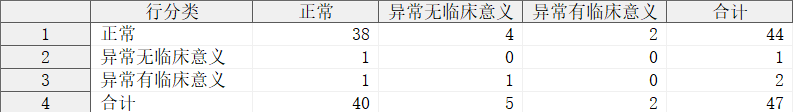
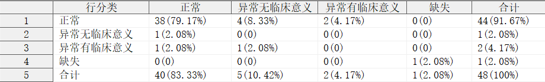

## 简介

$R \times C$ 列联表，计算频数及频率(可选)。

## 语法

### 必选参数

- [INDATA](#indata)
- [ROWCAT](#rowcat)
- [COLCAT](#colcat)
- [OUTDATA](#outdata)

### 可选参数

- [ROWCAT_BY](#rowcat_by)
- [COLCAT_BY](#colcat_by)
- [N](#n)
- [ADD_CAT_MISSING](#add_cat_missing)
- [ADD_CAT_OTHER](#add_cat_other)
- [ADD_CAT_ALL](#add_cat_all)
- [PCT_OUT](#pct_out)
- [FORMAT](#format)

### 调试参数

- [DEL_TEMP_DATA](#del_temp_data)

## 参数说明

### INDATA

**Syntax** : <_libname._>_dataset_(_dataset-options_)

指定用于定性分析的数据集，可包含数据集选项

_libname_: 数据集所在的逻辑库名称

_dataset_: 数据集名称

_dataset-options_: 数据集选项，兼容 SAS 系统支持的所有数据集选项

**Usage** :

```sas
INDATA = ADSL
INDATA = SHKY.ADSL
INDATA = SHKY.ADSL(where = (FAS = "Y"))
```

[**Example**](#一般用法)

---

### ROWCAT

**Syntax** :

- _variable_
- _variable_("_category-1_"<, "_category-2_", ...>)

指定列联表的行变量，_`category`_ 表示行变量的分类名称。

> [!WARNING]
>
> - 参数 ROWCAT 不允许指定不存在于参数 [INDATA](#indata) 指定的数据集中的变量；
> - 参数 ROWCAT 不允许指定数值分类，例如：ROWCAT = PARSIGN(1 2 3) 是不被允许的；
> - 参数 ROWCAT 允许指定重复的分类值，但没必要。

**Usage** :

```sas
ROWCAT = PARSIG
ROWCAT = PARSIG("正常" "异常无临床意义" "异常有临床意义")
```

[**Example**](#一般用法)

---

### COLCAT

**Syntax** :

- _variable_
- _variable_("_category-1_"<, "_category-2_", ...>)

指定列联表的列变量，_`category`_ 表示行变量的分类名称。用法同 [ROWCAT](#rowcat)

[**Example**](#一般用法)

---

### OUTDATA

**Syntax** : <_libname._>_dataset_(_dataset-options_)

指定统计结果输出的数据集，可包含数据集选项，用法同参数 [INDATA](#indata)。

> [!NOTE]
>
> - 输出数据集为一个 $R \times C$ 表的结构，行分类和列分类的组合构成数据集的主体部分，默认情况下还将输出行合计和列合计的频数及频率；
> - 若参数 [ADD_CAT_MISSING](#add_cat_missing) 指定了行和（或）列变量为 `TRUE`，则额外输出“缺失”分类的频数及频率；
> - 若参数 [ADD_CAT_OTHER](#add_cat_other) 指定了行和（或）列变量为 `TRUE`，则额外输出“其他”分类的频数及频率；
> - 对于行分类的排序方式：参数 [ROWCAT](#rowcat) 指定的行变量的分类值按参数 [ROWCAT_BY](#rowcat_by) 指定的排序变量及排序方向进行排序，若参数 [ROWCAT](#rowcat) 使用了手动指定分类值的方式，将按照手动指定的顺序进行排序（此时参数 [ROWCAT_BY](#rowcat_by) 的值将被忽略）；若额外指定了“缺失”、“其他”、“合计”分类，则按照“缺失”、“其他”、“合计”的顺序排序；列分类的排序方式同上所述;
> - 输出数据集的列名以 `COL_` 开头，按照列分类的顺序，使用数字作为后缀依次命名：`COL_1`、`COL_2`、`COL_3`、......，“缺失”分类的列名为 `COL_MISSING`、“其他”分类的列名为 `COL_OTHER`、“合计”分类的列名为 `COL_ALL`，此外第一列的内容为行变量的分类名称，列名为 `COL_0`;

**Usage** :

```sas
OUTDATA = CrossTable
```

---

### ROWCAT_BY

**Syntax** : _variable_<(ASC\<ENDING> | DESC\<ENDING>)>

指定列联表中行变量的排序变量和排序方向。

**Default** : #AUTO

根据参数 ROWCAT 的值的不同情况，宏程序将根据以下逻辑对行分类进行排序：

1. 若参数 ROWCAT 指定了具体的分类值，则按照各个分类指定的顺序进行排序，参数 ROWCAT 指定的第一个分类将输出至列联表的第一行，指定的第二个分类将输出至列联表的第二行，以此类推。此时将忽略参数 ROWCAT_BY 的值；
2. 若参数 ROWCAT 未指定具体的分类值，则考虑参数 ROWCAT_BY 指定的值。
   - 若参数 ROWCAT_BY 指定为默认值 #AUTO，则按照默认顺序对行分类值进行排序；
   - 若参数 ROWCAT_BY 指定为一个变量名，则根据行分类值在分析数据集中对应的该变量的值进行排序。例如：指定参数 ROWCAT = PARSIG, ROWCAT_BY = PARSIGN，宏程序自动获取变量 PARSIG 的分类为：“异常无临床意义”、“异常有临床意义”、“正常”，在分析数据集中对应的 PARSIGN 的值分别为：2、3、1，宏程序将首先对 PARSIGN 的值进行排序，根据排序结果调整 PARSIG 的分类顺序，若 PARSIGN 存在重复值，则根据 PARSIG 的值进一步排序。排序方向可手动指定为顺序或逆序排列，若未指定排序方向，则默认为升序排列。

**Usage** :

```sas
ROWCAT = PARSIGN
ROWCAT = PARSIGN(DESC)
ROWCAT = PARSIGN(DESCENDING)
```

[**Example**](#指定行列变量的分类值的排序变量和方向)

---

### COLCAT_BY

**Syntax** : _variable_<(ASC\<ENDING> | DESC\<ENDING>)>

指定列联表中列变量的排序变量和排序方向。用法同参数 [ROWCAT_BY](#rowcat_by)。

**Default** : #AUTO

---

### ADD_CAT_MISSING

**Syntax** : TRUE | FALSE <TRUE | FALSE>

指定是否在列联表的行或列中添加“缺失”分类。

参数 ADD_CAT_MISSING 的第一个值控制列联表的行是否添加“缺失”分类，第二个值控制列联表的列是否添加“缺失”分类。

**Default** : FALSE FALSE

> [!IMPORTANT]
>
> - 若参数 ADD_CAT_MISSING 仅指定了一个值，则对列联表的行或列中是否添加“缺失”分类均应用相同的策略。

[**Example**](#指定是否计算缺失分类)

---

### ADD_CAT_OTHER

**Syntax** : TRUE<(TYPE = 1 | 2)> | FALSE <TRUE<(TYPE = 1 | 2)> | FALSE>

指定是否在列联表的行或列中添加“其他”分类。

参数 ADD_CAT_OTHER 的第一个值控制列联表的行是否添加“其他”分类，第二个值控制列联表的列是否添加“其他”分类。

参数 ADD_CAT_OTHER 指定为 TRUE 时，“其他”分类的频数计算方式可通过选项 TYPE 进行控制：

- **TYPE = 1** : 将 ROWCAT 或 COLCAT 未指定的分类（排除缺失值）计入“其他”分类，TYPE = 1 为默认选项；
- **TYPE = 2** : 将 ROWCAT 或 COLCAT 未指定的分类（包含缺失值）计入“其他”分类。

**Default** : FALSE FALSE

> [!IMPORTANT]
>
> - 若参数 ADD_CAT_OTHER 仅指定了一个值，则对列联表的行或列中是否添加“其他”分类均应用相同的策略；
> - 若参数 ADD_CAT_OTHER 指定了 TRUE，但未指定选项 TYPE，则使用默认选项值 TYPE = 1；

[**Example**](#指定是否计算其他分类)

---

### ADD_CAT_ALL

**Syntax** : TRUE | FALSE <TRUE | FALSE>

指定是否在列联表的行或列中添加“合计”分类。

参数 ADD_CAT_ALL 的第一个值控制列联表的行是否添加“合计”分类，第二个值控制列联表的列是否添加“合计”分类。

**Default** : TRUE TRUE

> [!IMPORTANT]
>
> - 若参数 ADD_CAT_ALL 仅指定了一个值，则对列联表的行或列中是否添加“合计”分类均应用相同的策略。

[**Example**](#指定是否计算合计分类)

---

### N

**Syntax** : _numeric_

指定实际合计频数。

**Default** : #AUTO

默认情况下，参数 N 的值为参数 [INDATA](#indata) 指定的数据集的观测总数 _n_obs_。在参数 N 为默认值 `#AUTO` 的情况下，若参数 [ADD_CAT_MISSING](#add_cat_missing) 指定的值为 `FALSE FALSE` （默认值）时，行变量与列变量均为缺失值的观测将不计入观测总数 _n_obs_ 。

> [!TIP]
>
> - 参数 N 的值应当被指定为某个分析集的总频数。例如：在生成实验室检查的交叉表时，某次随访未进行实验室检查的受试者可能不在分析数据集 ADLB 中，此时可使用参数 N 指定安全性集人数，宏程序将根据已有检查结果的受试者人数与参数 N 指定的人数自动计算缺失人数，使用这种方法，无需将 ADLB 与 ADSL 合并。

> [!IMPORTANT]
>
> - 参数 N 的值将影响列联表中**所有**单元格**频率**的计算；
> - 参数 N 的值仅影响列联表中**某些**单元格**频数**的计算，具体如下（× 即为受影响的单元格频数）：
>   | | 列分类 1 | 列分类 2 | 缺失 | 其他（类型 1） | 其他（类型 2） | 合计 |
>   | -------------- | --------------------------- | --------------------------- | --------------------------------------- | --------------------------- | --------------------------------------- | --------------------------------------- |
>   | 行分类 1 | <font size = 5>**-**</font> | <font size = 5>**-**</font> | <font size = 5>**-**</font> | <font size = 5>**-**</font> | <font size = 5>**-**</font> | <font size = 5>**-**</font> |
>   | 行分类 2 | <font size = 5>**-**</font> | <font size = 5>**-**</font> | <font size = 5>**-**</font> | <font size = 5>**-**</font> | <font size = 5>**-**</font> | <font size = 5>**-**</font> |
>   | 缺失 | <font size = 5>**-**</font> | <font size = 5>**-**</font> | <font color = red size = 5>**×**</font> | <font size = 5>**-**</font> | <font color = red size = 5>**×**</font> | <font color = red size = 5>**×**</font> |
>   | 其他（类型 1） | <font size = 5>**-**</font> | <font size = 5>**-**</font> | <font size = 5>**-**</font> | <font size = 5>**-**</font> | <font size = 5>**-**</font> | <font size = 5>**-**</font> |
>   | 其他（类型 2） | <font size = 5>**-**</font> | <font size = 5>**-**</font> | <font color = red size = 5>**×**</font> | <font size = 5>**-**</font> | <font color = red size = 5>**×**</font> | <font color = red size = 5>**×**</font> |
>   | 合计 | <font size = 5>**-**</font> | <font size = 5>**-**</font> | <font color = red size = 5>**×**</font> | <font size = 5>**-**</font> | <font color = red size = 5>**×**</font> | <font color = red size = 5>**×**</font> |

> [!CAUTION]
>
> - 通常情况下 N 应当是一个不小于分析数据集观测数 _n_obs_ 的正整数，但当参数 N 被指定为负数、零或正浮点数时，宏程序仍将继续运行，但结果可能是非预期的。

[**Example**](#指定实际的合计频数)

---

### PCT_OUT

**Syntax** : TRUE | FALSE

指定是否计算列联表中各个单元格对应行列分类组合的频率。

**Default** : FALSE

[**Example**](#指定是否计算频率)

---

### FORMAT

**Syntax** : _format_

指定百分比的输出格式，该参数仅在 [PCT_OUT](#pct_out) 指定为 `TRUE` 时生效。

**Default** : PERCENTN9.2

[**Example**](#指定频率的输出格式)

---

### DEL_TEMP_DATA

**Syntax** : TRUE | FALSE

指定是否删除宏程序运行过程生成的中间数据集。

**Default** : TRUE

默认情况下，宏程序会自动删除运行过程生成的中间数据集。

> [!NOTE]
>
> 此参数用于开发者调试，一般无需关注。

---

## 例子

### 打开帮助文档

```sas
%cross_table();
%cross_table(help);
```

### 一般用法

```sas
%cross_table(indata = analysis1, rowcat = PARSIG1, colcat = PARSIG2);
```


上述例子中，行变量为 PARSIG1，列变量为 PARSIG2，宏程序根据变量 PARSIG1 与 PARSIG2 的分类值自动构建列联表。

```sas
%cross_table(indata = analysis1,
             rowcat = PARSIG1("正常" "异常无临床意义" "异常有临床意义"),
             colcat = PARSIG2("正常" "异常无临床意义" "异常有临床意义"));
```



上述例子中，行列变量均通过参数指定了各自的分类值，因此宏程序将根据分类值及出现的顺序构建列联表。

### 指定输出数据集

```sas
/*指定输出数据集*/
%cross_table(indata = analysis1,
             rowcat = PARSIG1,
             colcat = PARSIG2,
             rowcat_by = PARSIG1N,
             colcat_by = PARSIG2N,
             add_cat_missing = TRUE TRUE,
             add_cat_all = TRUE TRUE,
             pct_out = TRUE,
             outdata = result);

/*指定输出数据集和数据集选项*/
%cross_table(indata = analysis1,
             rowcat = PARSIG1,
             colcat = PARSIG2,
             rowcat_by = PARSIG1N,
             colcat_by = PARSIG2N,
             add_cat_missing = TRUE TRUE,
             add_cat_all = TRUE TRUE,
             pct_out = TRUE,
             outdata = result(rename = (COL_0 = ROWCAT COL_1 = NORMAL COL_2 = NCS COL_3 = CS COL_MISSING = MISSING COL_ALL = ALL)));
```

### 指定行、列变量的分类值的排序变量和方向

```sas
%cross_table(indata = analysis,
             rowcat = PARSIG1,
             colcat = PARSIG2,
             rowcat_by = PARSIG1N,
             colcat_by = PARSIG2N);
```


上述例子中，通过参数 ROWCAT_BY 和 COLCAT_BY 对行变量 PARSIG1 和列变量 PARSIG2 的分类值的排列顺序进行控制，由于未指定排序方向，因此默认使用升序排列。

```sas
%cross_table(indata = analysis,
             rowcat = PARSIG1,
             colcat = PARSIG2,
             rowcat_by = PARSIG1N(desc),
             colcat_by = PARSIG2N(desc));
```


上述例子中，通过参数 ROWCAT_BY 和 COLCAT_BY 对行变量 PARSIG1 和列变量 PARSIG2 的分类值的排列顺序进行控制，并同时指定了降序的排列方式。

### 指定是否计算“缺失”分类

```sas
%cross_table(indata = analysis1,
             rowcat = PARSIG1,
             colcat = PARSIG2,
             rowcat_by = PARSIG1N,
             colcat_by = PARSIG2N,
             add_cat_missing = TRUE);
```


上述例子中，参数 ADD_CAT_MISSING 指定行列变量均计算“缺失”分类。

```sas
%cross_table(indata = analysis1,
             rowcat = PARSIG1,
             colcat = PARSIG2,
             rowcat_by = PARSIG1N,
             colcat_by = PARSIG2N,
             add_cat_missing = TRUE FALSE);
```


上述例子中，参数 ADD_CAT_MISSING 指定行变量计算“缺失”分类，列变量不计算“缺失”分类。

### 指定是否计算“其他”分类

```sas
%cross_table(indata = analysis1,
             rowcat = PARSIG1,
             colcat = PARSIG2,
             rowcat_by = PARSIG1N,
             colcat_by = PARSIG2N,
             add_cat_missing = TRUE,
             add_cat_other = TRUE);
```


上述例子中，参数 ADD_CAT_OTHER 指定行列变量均计算“其他”分类，由于未指定计算类型，因此按默认处理方式，缺失值不纳入到“其他”分类中。

```sas
%cross_table(indata = analysis1,
             rowcat = PARSIG1,
             colcat = PARSIG2,
             rowcat_by = PARSIG1N,
             colcat_by = PARSIG2N,
             add_cat_missing = TRUE,
             add_cat_other = TRUE(type = 2));
```


上述例子中，参数 ADD_CAT_OTHER 指定行列变量均计算“其他”分类，由于指定了 TYPE = 2，因此缺失值也被纳入到“其他”分类中。

```sas
%cross_table(indata = analysis1,
             rowcat = PARSIG1,
             colcat = PARSIG2,
             rowcat_by = PARSIG1N,
             colcat_by = PARSIG2N,
             add_cat_missing = TRUE,
             add_cat_other = TRUE(type = 1) TRUE(type = 2));
```


上述例子中，参数 ADD_CAT_OTHER 指定行列变量均计算“其他”分类，对于行变量 PARSIG1，指定了 TYPE = 1，因此 PARSIG1 的缺失值不纳入到行分类的“其他”分类中，对于列变量 PARSIG2，指定了 TYPE = 2，因此 PARSIG2 的缺失值被纳入到列分类的“其他”分类中。

### 指定是否计算“合计”分类

```sas
%cross_table(indata = analysis1,
             rowcat = PARSIG1,
             colcat = PARSIG2,
             rowcat_by = PARSIG1N,
             colcat_by = PARSIG2N,
             add_cat_missing = TRUE,
             add_cat_other = TRUE,
             add_cat_all = TRUE);
```


上述例子中，参数 ADD_CAT_ALL 指定行列变量均计算“合计”分类，这也是宏程序的默认处理方式。

```sas
%cross_table(indata = analysis1,
             rowcat = PARSIG1,
             colcat = PARSIG2,
             rowcat_by = PARSIG1N,
             colcat_by = PARSIG2N,
             add_cat_missing = TRUE,
             add_cat_other = TRUE,
             add_cat_all = FALSE);
```


上述例子中，参数 ADD_CAT_ALL 指定行列变量均不计算“合计”分类。

```sas
%cross_table(indata = analysis1,
             rowcat = PARSIG1,
             colcat = PARSIG2,
             rowcat_by = PARSIG1N,
             colcat_by = PARSIG2N,
             add_cat_missing = TRUE,
             add_cat_other = TRUE,
             add_cat_all = TRUE FALSE);
```


上述例子中，参数 ADD_CAT_ALL 指定行变量计算“合计”分类，列变量不计算“合计”分类。

### 指定实际的合计频数

```sas
%cross_table(indata = analysis1,
             rowcat = PARSIG1,
             colcat = PARSIG2,
             rowcat_by = PARSIG1N,
             colcat_by = PARSIG2N,
             add_cat_missing = TRUE TRUE,
             add_cat_all = TRUE TRUE,
             n = 50);
```


上述例子中，参数 N 指定了实际的合计频数为 50，超过了分析数据集 ANALYSIS1 的观测总数，此时说明存在某些行变量 PARSIG1 和 列变量 PARSIG2 均缺失的观测，由于未记录 PARSIG1 和 PARSIG2 的值，导致分析数据集的观测总数低于实际的合计频数。

### 指定是否计算频率

```sas
%cross_table(indata = analysis1,
             rowcat = PARSIG1,
             colcat = PARSIG2,
             rowcat_by = PARSIG1N,
             colcat_by = PARSIG2N,
             add_cat_missing = TRUE TRUE,
             add_cat_all = TRUE TRUE,
             pct_out = TRUE);
```


上述例子中，参数 PCT_OUT 指定宏程序计算列联表中每个单元格对应的行列分类组合的频率。

### 指定频率的输出格式

```sas
proc format;
    picture srate(round)
            0 = "0"(noedit)
            0 < - < 1 = "009.99%"(multiplier = 10000)
            1 = "100%"(noedit);
run;
%cross_table(indata = analysis1,
             rowcat = PARSIG1,
             colcat = PARSIG2,
             rowcat_by = PARSIG1N,
             colcat_by = PARSIG2N,
             add_cat_missing = TRUE TRUE,
             add_cat_all = TRUE TRUE,
             pct_out = TRUE,
             format = srate.);
```



上述例子中，参数 FORMAT 指定了一个自定义输出格式 SRATE.，宏程序使用该格式输出频率。
