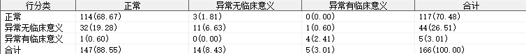
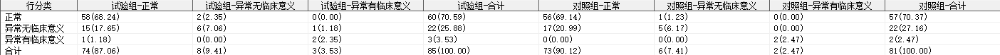
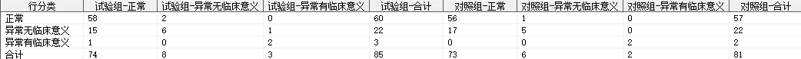

# %crosstab

## 简介

交叉表。

## 语法

### 参数

#### 必选参数

- [indata](#indata)
- [outdata](#outdata)
- [rowcat](#rowcat)
- [colcat](#colcat)
- [rowcat_by](#rowcat_by)
- [colcat_by](#colcat_by)

#### 可选参数

- [rowcat_missing](#rowcat_missing)
- [colcat_missing](#colcat_missing)
- [rowcat_total](#rowcat_total)
- [colcat_total](#colcat_total)
- [arm](#arm)
- [arm_by](#arm_by)
- [format_freq](#format_freq)
- [output_rate](#output_rate)
- [format_rate](#format_rate)

#### 调试参数

- [debug](#debug)

### 参数说明

#### indata

**Syntax** : _data-set-name_<(_data-set-option_)>

指定待分析的数据集，可使用数据集选项。

> [!TIP]
>
> [indata](#indata) 必须包含所有需要纳入分析的对象，如果指定了 `rowcat_missing = true` 或 `colcat_missing = true`，则需要包括数据缺失的对象，详见 [rowcat_missing](#rowcat_missing) 和 [colcat_missing](#colcat_missing)。
>
> 举例，如果需要输出血红蛋白含量随访期与基线检查结果临床意义的交叉表，可参考以下代码构建分析数据集：
>
> ```sas
> data analysis;
>     merge adam.adsl(where = (fasfl = "Y"))
>           adam.adae(where = (param = "血红蛋白含量" and avisit = "随访期"));
>     by usubjid;
> run;
> ```

**Usage** :

```sas
indata = analysis
```

---

#### outdata

**Syntax** : _data-set-name_<(_data-set-option_)>

指定保存交叉表数据的数据集，可使用数据集选项。

宏程序运行过程中，可能会生成以下变量，其中只有部分变量会保留在数据集中，其余变量将被移除。

将所有生成的变量列举于此，以便后续调试参考之用：

| 变量名                 | 类型   | 含义                              | 是否保留 |
| ---------------------- | ------ | --------------------------------- | -------- |
| **ITEM**               | _char_ | 行分类名称                        | **是**   |
| **G*x*\_CAT*y*\_FREQ** | _num_  | 组别 _x_ 列分类 _y_ 频数          | 否       |
| G*x*\_CAT*y*\_RATE     | _num_  | 组别 _x_ 列分类 _y_ 率            | 否       |
| G*x*\_CAT*y*\_FREQ_FMT | _char_ | 组别 _x_ 列分类 _y_ 频数格式化值  | 否       |
| G*x*\_CAT*y*\_RATE_FMT | _char_ | 组别 _x_ 列分类 _y_ 率格式化值    | 否       |
| G*x*\_CAT*y*\_VALUE    | _char_ | 组别 _x_ 列分类 _y_ 输出值        | **是**   |
| G*x*\_CATM_FREQ        | _num_  | 组别 _x_ 缺失频数                 | 否       |
| G*x*\_CATM_RATE        | _num_  | 组别 _x_ 缺失率                   | 否       |
| G*x*\_CATM_FREQ_FMT    | _char_ | 组别 _x_ 缺失频数格式化值         | 否       |
| G*x*\_CATM_RATE_FMT    | _char_ | 组别 _x_ 缺失率格式化值           | 否       |
| G*x*\_CATM_VALUE       | _char_ | 组别 _x_ 缺失输出值               | **是**   |
| G*x*\_CATT_FREQ        | _num_  | 组别 _x_ 合计频数                 | 否       |
| G*x*\_CATT_RATE        | _num_  | 组别 _x_ 合计率                   | 否       |
| G*x*\_CATT_FREQ_FMT    | _char_ | 组别 _x_ 合计频数格式化值         | 否       |
| G*x*\_CATT_RATE_FMT    | _char_ | 组别 _x_ 合计率格式化值           | 否       |
| G*x*\_CATT_VALUE       | _char_ | 组别 _x_ 合计输出值               | **是**   |
| ALL_CAT*y*\_FREQ       | _num_  | 不区分组别，分类 _y_ 频数         | 否       |
| ALL_CAT*y*\_RATE       | _num_  | 不区分组别，分类 _y_ 率           | 否       |
| ALL_CAT*y*\_FREQ_FMT   | _char_ | 不区分组别，分类 _y_ 频数格式化值 | 否       |
| ALL_CAT*y*\_RATE_FMT   | _char_ | 不区分组别，分类 _y_ 率格式化值   | 否       |
| ALL_CAT*y*\_VALUE      | _char_ | 不区分组别，分类 _y_ 输出值       | **是**   |
| ALL_CATM_FREQ          | _num_  | 不区分组别，缺失频数              | 否       |
| ALL_CATM_RATE          | _num_  | 不区分组别，缺失率                | 否       |
| ALL_CATM_FREQ_FMT      | _char_ | 不区分组别，缺失频数格式化值      | 否       |
| ALL_CATM_RATE_FMT      | _char_ | 不区分组别，缺失率格式化值        | 否       |
| ALL_CATM_VALUE         | _char_ | 不区分组别，缺失输出值            | **是**   |
| ALL_CATT_FREQ          | _num_  | 不区分组别，合计频数              | 否       |
| ALL_CATT_RATE          | _num_  | 不区分组别，合计率                | 否       |
| ALL_CATT_FREQ_FMT      | _char_ | 不区分组别，合计频数格式化值      | 否       |
| ALL_CATT_RATE_FMT      | _char_ | 不区分组别，合计率格式化值        | 否       |
| ALL_CATT_VALUE         | _char_ | 不区分组别，合计输出值            | **是**   |
| \_PLACEHOLDER\_        | _char_ | 占位符<sup>1</sup>                | 否       |

G*x* 表示第 _x_ 个组别，CAT*y* 表示第 _y_ 个分类。

> [!NOTE]
>
> 1. 占位符的作用是简化宏内 `PROC SQL` 语句的拼接。

> [!TIP]
> 如果不需要输出“不区分组别”的结果，可指定数据集选项 `drop = ALL_:`。

**Usage** :

```sas
outdata = out
```

---

#### rowcat

**Syntax** : _variable_

指定行分类变量。

**Usage** :

```sas
rowcat = clsig
```

---

#### colcat

**Syntax** : _variable_

指定列分类变量。

**Usage** :

```sas
colcat = bclsig
```

#### rowcat_by

**Syntax** :

- _format_
- _format_(asc)
- _format_(ascending)
- _format_(desc)
- _format_(descending)

指定行分类变量字典，它应当是一个 `format`，`format` 可以通过以下语句定义：

```sas
proc format;
    value clsign
        1 = "正常"
        2 = "异常无临床意义"
        3 = "异常有临床意义";
run;
```

[outdata](#outdata) 中行分类的值将按照上述 `format` 中对应数值的大小按顺序排列，`asc`, `ascending` 表示正序排列，`desc`, `descending` 表示逆序排列，若未指定，默认为 `ascending`。

**Usage** :

```sas
rowcat_by = clsign.
rowcat_by = clsign.(asc)
rowcat_by = clsign.(descending)
```

---

#### colcat_by

**Syntax** :

- _format_
- _format_(asc)
- _format_(ascending)
- _format_(desc)
- _format_(descending)

指定列分类变量字典，用法同 [rowcat_by](#rowcat_by)。

**Usage** :

```sas
colcat_by = clsign.
colcat_by = clsign.(asc)
colcat_by = clsign.(descending)
```

---

#### rowcat_missing

**Syntax** : `true` | `false`

指定是否统计行分类变量的缺失值。

**Default** : `true`

**Usage** :

```sas
rowcat_missing = false
```

---

#### colcat_missing

**Syntax** : `true` | `false`

指定是否统计列分类变量的缺失值。

**Default** : `true`

**Usage** :

```sas
colcat_missing = false
```

---

#### rowcat_total

**Syntax** : `true` | `false`

指定是否统计行分类变量的合计值。

**Default** : `true`

**Usage** :

```sas
rowcat_total = false
```

---

#### colcat_total

**Syntax** : `true` | `false`

指定是否统计列分类变量的合计值。

**Default** : `true`

**Usage** :

```sas
colcat_total = false
```

---

#### arm

**Syntax** : _variable_ | `#null`

指定组别变量。

**Default** : `#null`

默认情况下，将 [indata](#indata) 视为单组试验的数据集进行汇总。

**Usage** :

```sas
arm = arm
```

---

#### arm_by

**Syntax** :

- _format_
- _format_(asc)
- _format_(ascending)
- _format_(desc)
- _format_(descending)

指定组别变量字典，用法同 [rowcat_by](#rowcat_by)。

**Default** : `#null`

> [!IMPORTANT]
>
> [arm](#arm) 和 [arm_by](#arm_by) 必须同时指定或不指定。

**Usage** :

```sas
arm_by = armn.
arm_by = armn.(desc)
```

---

#### format_freq

**Syntax** : _format_

指定频数的输出格式。

**Default** : `best12.`

**Usage** :

```sas
format_freq = 8.
```

---

#### output_rate

**Syntax** : `true` | `false`

指定是否输出率。

**Default** : `true`

**Usage** :

```sas
output_rate = false
```

---

#### format_rate

**Syntax** : _format_

指定率的输出格式。

**Default** : `percentn9.2`

**Usage** :

```sas
format_rate = 8.3
```

---

#### debug

**Syntax** : `true` | `false`

指定是否删除中间过程生成的数据集。

**Default** : `false`

> [!NOTE]
>
> 这是一个用于开发者调试的参数，通常不需要关注。

## 示例

以下代码是调用示例程序前的前置程序：

```sas
proc format;
    picture srate(round)
            -1         = '-100.00'(noedit)
            -1 < - < 0 = '-09.99'(multiplier = 10000 prefix = '-')
            0 - < 1    = '09.99'(multiplier = 10000)
            1          = '100.00'(noedit);

    value armn
        1 = "试验组"
        2 = "对照组";

    value clsign
        1 = "正常"
        2 = "异常无临床意义"
        3 = "异常有临床意义";
run;

proc sql noprint;
    create table analysis as
        select
            a.usubjid,
            a.siteid,
            a.arm,
            a.armn,
            b.avisit,
            b.avisitn,
            b.param,
            b.paramn,
            b.clsig,
            b.bclsig
        from adam.adsl(where = (saffl = "Y")) as a left join adam.adlb(where = (avisit = "术后0~7D" and param = "血红蛋白含量")) as b on a.usubjid = b.usubjid;
quit;
```

### Example 1 单组试验

```sas
%crosstab(indata          = analysis,
          outdata         = out,
          rowcat          = clsig_d,
          colcat          = bclsig_d,
          rowcat_by       = clsign.,
          colcat_by       = clsign.,
          rowcat_missing  = false,
          colcat_missing  = false,
          format_rate     = srate.);
```



### Example 2 对照试验

```sas
%crosstab(indata          = analysis,
          outdata         = out(drop = ALL_:),
          rowcat          = clsig,
          colcat          = bclsig,
          rowcat_by       = clsign.,
          colcat_by       = clsign.,
          rowcat_missing  = false,
          colcat_missing  = false,
          arm             = arm,
          arm_by          = armn.,
          format_rate     = srate.);
```



### Example 3 仅输出频数

```sas
%crosstab(indata          = analysis,
          outdata         = out(drop = ALL_:),
          rowcat          = clsig,
          colcat          = bclsig,
          rowcat_by       = clsign.,
          colcat_by       = clsign.,
          rowcat_missing  = false,
          colcat_missing  = false,
          arm             = arm,
          arm_by          = armn.,
          output_rate     = false);
```


