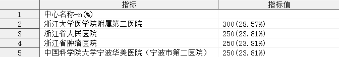
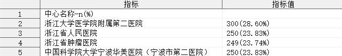
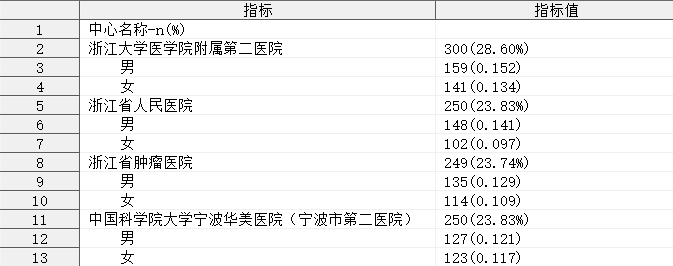
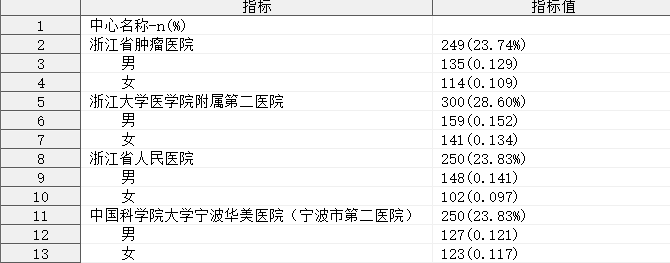
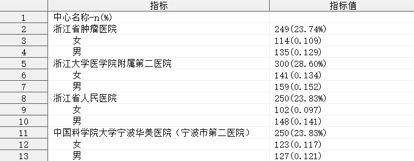
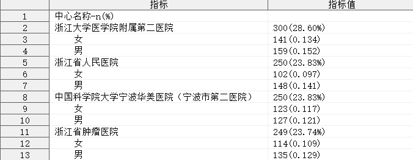
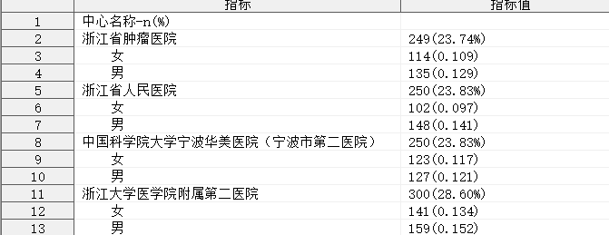
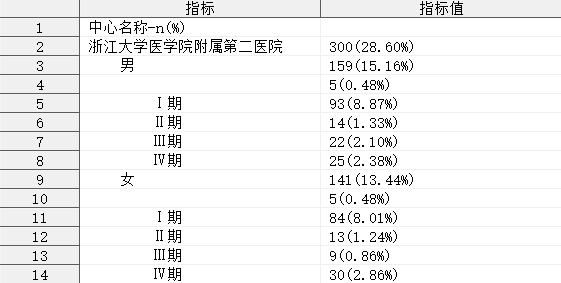

## 简介

单组多层级定性指标的分析，输出频数、构成比（率）指标。

> [!WARNING]
>
> 自 v1.5.0 开始，本程序已被弃用，将不会有任何功能更新和 Bug 修复，在 [%qualify_strata](../qualify_strata/readme.md) 开发完成前，仍然保留这个宏程序。

## 语法

### 必选参数

- [indata](#indata)
- [var](#var)

### 可选参数

- [format](#format)
- [by](#by)
- [missing](#missing)
- [denominator](#denominator)
- [indent](#indent)
- [label](#label)
- [is_label_indent](#is_label_indent)
- [is_label_display](#is_label_display)
- [outdata](#outdata)

### 调试参数

- [debug](#debug)

### 扩展参数

- [del_dup_by_var](#del_dup_by_var)
- [skip_param_check](#skip_param_check)
- [skip_main_prog](#skip_main_prog)
- [param_valid_flag_check](#param_valid_flag_check)
- [param_list_buffer](#param_list_buffer)

## 参数说明

### indata

**Syntax** : <_libname._>_dataset_(_dataset-options_)

指定用于定性分析的数据集，可包含数据集选项

_libname_: 数据集所在的逻辑库名称

_dataset_: 数据集名称

_dataset-options_: 数据集选项，兼容 SAS 系统支持的所有数据集选项

**Usage** :

```sas
indata = adsl
indata = adam.adsl
indata = adam.adsl(where = (fasfl = "Y"))
```

---

### var

**Syntax** : _variable-1_ <_variable-2_ <...>>

指定分析的变量，可以指定多个变量。

当指定一个变量时，将进行简单的分类统计，计算各分类的频数和频率；

当指定多个变量时，将根据指定变量的先后顺序，形成层级结构，对各层级进行统计，计算频数和频率。

> [!WARNING]
>
> - 参数 `var` 不允许指定重复的变量；
> - 参数 `var` 不允许指定不存在于参数 `indata` 指定的数据集中的变量；
> - 由于 SAS 系统的限制，最多允许指定 255 个分析变量。

**Example** :

```sas
var = sex
var = sex agegr tucat
```

[**Example: 指定单个分析变量**](#指定单个分析变量)

[**Example: 指定多个分析变量**](#指定多个分析变量)

---

### format

**Syntax** : _format-1_ <_format-2_ <...>>

指定变量统计结果展示的频率输出格式，指定多个输出格式时应与参数 `var` 指定的变量个数相匹配。

**Default** : `percentn9.2 <percentn9.2>`

默认情况下，宏程序将根据参数 `var` 指定的变量个数 _`n`_，指定参数 `format` 为 _`n`_ 个 `percentn9.2`。

> [!WARNING]
>
> - 当参数 `format` 指定的输出格式数量 _`m`_ 少于参数 `var` 指定的变量个数 _`n`_ 时，将重复参数 `format` 的最后一个输出格式，以便与变量个数相匹配。例如：指定参数 `VAR = sex agegr tucat, format = percent9.2 5.3` 时，宏程序将自动转换参数 `format = PERCENT9.2 5.3 5.3`；
> - 当参数 `format` 指定的输出格式数量 _`m`_ 多于参数 `VAR` 指定的变量个数 _`n`_ 时，将忽略参数 `format` 中的最后 _`m-n`_ 个多余的输出格式。例如：指定参数 `VAR = sex agegr tucat, format = percent9.2 5.3 5.3 yymmdd10.` 时，宏程序将自动转换参数 `format = PERCENT9.2 5.3 5.3`；
> - 参数 `format` 不允许指定不存在的输出格式。

**Usage** :

```sas
format = percent9.2
format = percent9.2 5.3 6.4 7.5
```

[**Example: 指定输出格式**](#指定输出格式)

---

### by

**Syntax** : _by-specification-1_ <_by-specification-2_ <...>>

指定变量统计结果的排序依据，其中 _`by-specification`_ 可以是：

| 值                                                  | 含义                                                                                                                                                                                                              |
| --------------------------------------------------- | ----------------------------------------------------------------------------------------------------------------------------------------------------------------------------------------------------------------- |
| `#freq_min`                                         | 该层级内按照各水平统计结果的频数进行从大到小的排序                                                                                                                                                                |
| `#freq_max`                                         | 该层级内按照各水平统计结果的频数进行从小到大的排序                                                                                                                                                                |
| _`variable`_<(`desc`\<`ending`>\|`asc`\<`ending`>)> | 该层级内按照指定变量进行指定方向的排序，其中 `descending` 表示降序排列，`ascending` 表示升序排列，`descending` 和 `ascending` 可以分别使用缩写 `desc` 和 `asc` 进行替代，若没有指定排序方向，则默认为 `ascending` |

指定多个排序依据时应与参数 `var` 的变量个数相匹配。

**Default** : `&var`

默认情况下，宏程序将根据参数 `var` 指定的变量自身的值对结果进行排序。

> [!WARNING]
>
> - 若参数 `by` 指定的排序依据数据 _`m`_ 为 1，且该排序依据为 `#freq_max` 时，参数 `var` 中的所有变量的排序依据均被指定为 `#freq_max`，即参数 `var` 中的所有变量的统计结果均按照频数从大到小排列；
> - 当参数 `by` 指定的排序依据数量 _`m`_ 为 1，且该排序依据为 `#freq_min` 时，参数 `var` 中的所有变量的排序依据均被指定为 `#freq_min`，即参数 `var` 中的所有变量的统计结果均按照频数从小到大排列；
> - 当参数 `by` 指定的排序依据数量 _`m(m>1)`_ 少于参数 `var` 指定的变量个数 `n` 时，对于参数 `var` 中未指定排序依据的变量 _`variable-m+1, variable-m+2, ..., variable-n`_，将基于 _`variable-m+1, variable-m+2, ..., varibale-n`_ 自身的值进行排序。例如：指定参数 `var = sex agegr tucat，by = sexn agegrn` 时，宏程序将自动转换参数 `by = sexn agegrn tucat`；
> - 当参数 `by` 指定的排序依据数量 _`m`_ 多于参数 `var` 指定的变量个数 `n` 时，将忽略参数 `by` 中最后 `m-n` 个多余的排序依据。例如：指定参数 `var = sex agegr tucat，by= sexn agegrn tucatn racen`，宏程序将自动转换参数 `by = sexn agegrn tucatn`；
> - 参数 `by` 不允许指定重复的排序变量，例如 `by = sexn sexn sexn` 是不被允许的；
> - 参数 `by` 不允许对参数 `var` 的第 `i` 个变量指定参数 `var` 的第 `j` 个变量作为排序变量，例如 `var = sex agegr tucat, by = agegr sex tucat` 是不被允许的；
> - 参数 `by` 不允许指定不存在于参数 `indata` 指定的数据集中的变量。

**Usage** :

```sas
by = #freq_max
by = #freq_min
by = sexn
by = sexn(desc)
by = sexn(ascending)
by = sexn(desc) agegrn(ascending) tucatn
by = sexn(desc) agegrn(ascending) tucatn #freq_max #freq_min
```

[**Example: 指定排序方式**](#指定排序方式)

---

### missing

**Syntax** : `true` | `false` <`true` | `false`>

指定是否计算缺失值的频数与频率，即是否将缺失值视为某个变量下的一个分类参与统计，指定多个 `true`（或 `false`）时应与参数 [var](#var) 的变量个数相匹配。

| 值      | 含义                                                 |
| ------- | ---------------------------------------------------- |
| `true`  | 将缺失值视为某个变量下的一个分类参与统计频数和频率   |
| `false` | 忽略缺失值，仅对变量的非缺失值进行分类统计频数和频率 |

**Default** : `false`

> [!WARNING]
>
> - 当参数 `missing` 指定为 `true` 时，参数 `VAR` 中的所有变量均将缺失值视为一个分类进行统计，计算缺失值的频数和频率；
> - 当参数 `missing` 指定为 `false` 时，参数 `VAR` 中的所有变量均忽略缺失值，仅对各自变量的非缺失值进行分类统计，不计算缺失值的频数与频率；
> - 当参数 `missing` 指定的 `true`（或 `false`）的数量 _`m`_ 少于参数 `VAR` 指定的变量个数 `n` 时，对于参数 `VAR` 中未匹配 `true`（或 `false`）的变量 _`variable-m+1, variable-m+2, ..., variable-n`_，将重复参数 `missing` 的最后一个 `true`（或 `false`）。例如：指定参数 `VAR = sex agegr tucat, missing = true false` 时，宏程序将自动转换参数 `missing = true false false`；
> - 当参数 `missing` 指定的 `true`（或 `false`）的数量 _`m`_ 多于参数 `VAR` 指定的变量个数 `n` 时，将忽略参数 `missing` 中最后 `m-n` 个多于的 `true`（或 `false`）。例如：指定参数 `VAR= sex agegr tucat, missing = true false true false`，宏程序将自动转换参数 `missing = true false true`。

**Usage** :

```sas
missing = true
missing = true false false
```

[**Example: 指定缺失值处理方式**](#指定缺失值处理方式)

---

### denominator

**Syntax** : _denominator-specification-1_ <_denominator-specification-2_ <...>>

指定用于计算频率的依据，指定多个计算频率的依据时应与参数 `var` 的变量个数相匹配。

当参数 `var` 指定多个分析变量时，第一个分析变量为 **最顶层变量**，最顶层分析变量的 **第 _k_ 水平频率 = 水平 _k_ 的频数/所有水平频数之和 × 100%**，该变量无需使用参数 `denominator` 指定计算频率的依据，因此参数 `denominator` 的第一个值实际上指定的是参数 `var` 的第二个分析变量的计算频率的依据，同理，参数 `denominator` 的第 _`i`_ 个值指定的是参数 `var` 的第 _`j(j=i+1)`_ 个分析变量计算频率的依据。

_`denominator-specification`_ 的具体取值及含义如下：

| 值           | 含义                                                                                                                                                              |
| ------------ | ----------------------------------------------------------------------------------------------------------------------------------------------------------------- |
| `#all`       | 第 _`j`_ 个分析变量的第 _`k`_ 水平的频率 = 第 _`j`_ 个分析变量的水平 _`k`_ 的频数/最顶层分析变量所有水平频数之和                                                  |
| `#last`      | 第 _`j`_ 个分析变量的第 _`k`_ 水平的频率 = 第 _`j`_ 个分析变量的水平 _`k`_ 的频数/第 _`j`_ 个分析变量的水平 _`k`_ 所在的第 _`j-1`_ 个分析变量的水平 _`k'`_ 的频数 |
| _`num`_      | 第 _`j`_ 个分析变量的第 _`k`_ 水平的频率 = 第 _`j`_ 个分析变量的水平 _`k`_ 的频数/第 _`j`_ 个分析变量对应的参数 `denominator` 指定的第 _`j-1`_ 个值               |
| _`variable`_ | 第 _`j`_ 个分析变量的第 _`k`_ 水平的频率 = 第 _`j`_ 个分析变量的水平 _`k`_ 的频数/第 _`j`_ 个分析变量的水平 _`k`_ 所在的分析变量的水平 _`k'`_ 的频数              |

**Default** : `#auto`

默认情况下，宏程序将为参数 `var` 指定的所有分析变量指定基于合计频数计算频率。

> [!WARNING]
>
> - 当参数 `denominator` 指定为 `#all` 时，参数 `var` 中的所有变量将基于合计频数计算频率，**注意**：参数 [missing](#missing) 的值将会影响参数 `denominator` 指定为 `#all` 时的表现，当参数 `missing` 指定部分变量忽略缺失值时，这些缺失值对应的观测也将不计入合计频数中；
> - 当参数 `denominator` 指定为 `#last` 时，参数 `var` 中的除第一个变量之外的其他所有变量将基于自身所处的上一层级的水平的频数计算频率；
> - 当参数 `denominator` 指定的 `#all`、`#last`、_`num`_、_`variable`_ 的数量 _`m`_ 少于参数 `var` 指定的变量个数 _`n-1`_ 时，对于参数 `var` 中未匹配的变量 _`variable-m+2, variable-m+3, ..., variable-n`_，将指定 `#all` 作为它们计算频率的依据。例如：指定参数 `var = sex agegr tucat, denominator = sex` 时，宏程序将自动转换参数 `denominator = sex #all`；
> - 当参数 `denominator` 指定的 `#all`、`#last` 、_`num`_、_`variable`_ 的数量 _`m`_ 多于参数 `var` 指定的变量个数 _`n-1`_ 时，将忽略参数 `denominator` 的最后 `m-n+1` 个多余的 `#all`、`#last`、_`variable`_。例如：指定参数 `var = sex agegr tucat, denominator = sex #last #all`，宏程序将自动转换参数 `denominator = sex #last`；
> - 参数 `denominator` 不允许指定参数 `var` 的变量之外的其他变量；
> - 参数 `denominator` 不允许对参数 `var` 的第 _`i`_ 个变量指定自身作为计算频率的变量；
> - 参数 `denominator` 不允许对参数 `var` 的第 _`i`_ 个变量指定参数 `var` 的第 _`j(j>i)`_ 个变量作为计算频率的变量。

> [!TIP]
>
> **denominator = _num_**
>
> 当参数 `denominator` 被指定为一个且仅有一个数值 `num` 时，所有分析变量（**包括参数 `var` 指定的第一个分析变量**）的任何水平的频率均基于该数值进行计算。例如：指定参数 `var = sex agegr tucat, denominator = 79` 时，分析变量 `sex, agegr, tucat` 的任意水平及任何水平组合的频率 = 该水平或水平组合的频数 / 79。
>
> **注意**： 参数 `denominator` 不允许指定为负数。

---

### indent

**Syntax** : _string_

指定统计结果中各层级水平名称之间的单位缩进字符，表示相邻两个层级之间的水平名称在显示时缩进的字符串。

**Default** : `%bquote( )`

默认情况下，输出结果中当前层级的水平名称将在其上层相应水平名称的基础上缩进四格空格。

> [!TIP]
>
> - 若使用行内格式化语法表示缩进，可指定参数 `indent = @w@w@w@w`（假设指定 `ods escapechar = "@"`）。

[**Example: 指定缩进字符串**](#指定缩进字符串)

---

### label

**Syntax** : _string_

指定统计结果中首行显示的标签字符串。

**Default** : `#auto`

默认情况下，宏程序将会查找参数 [var](#var) 指定的第一个变量在参数 [indata](#indata) 指定的数据集中的标签，并与字符串 `-n(%)` 连接，作为统计结果中首行显示的标签字符串，若参数 `var` 指定的第一个变量的标签为空，则将 _`variable-1`_`-n(%)` 作为统计结果中首行显示的标签字符串。

[**Example: 指定分析变量标签**](#指定分析变量标签)

---

### is_label_indent

**Syntax** : `true` | `false`

指定首行标签字符串是否进行缩进。

**Default** : `false`

默认情况下，宏程序将在输出的数据集中的首行显示由参数 `label` 指定的字符串，且该字符串与最顶层变量的水平名称对齐。当指定参数 `is_label_indent = true` 时，标签行将额外向前缩进一段长度，在视觉上表现为参数 `var` 指定的分析变量的所有水平及水平组合名称都将向后缩进一段长度，缩进的长度由参数 `indent` 控制。

---

### is_label_display

**Syntax** : `true` | `false`

指定首行标签字符串是否进行显示。

**Default** : `true`

默认情况下，宏程序将在输出的数据集中的首行显示由参数 `label` 指定的字符串。

当指定参数 `is_label_display = FALSE` 时，将不显示标签行。**注意** : 此时参数 `is_label_indent` 仍然生效，也就是说，同时指定 `is_label_indent = true` 和 `is_label_display = false` 不会引发错误，此时输出结果中所有分类均会缩进一段长度，缩进的长度仍然由参数 `indent` 控制。

---

### outdata

**Syntax** : <_libname._>_dataset_(_dataset_options_)

指定统计结果输出的数据集，可包含数据集选项，用法同参数 [indata](#indata)。

**Default** : `#auto`

默认情况下，宏程序会查找参数 [var](#var) 指定的第一个变量的变量名 _`var-1`_，将输出数据集命名为 `res_`_`var-1`_。

输出数据集包含若干变量，具体如下：

| 变量名              | 含义                                                                                                                                                                                    |
| ------------------- | --------------------------------------------------------------------------------------------------------------------------------------------------------------------------------------- |
| `item`              | 分析变量层级结构                                                                                                                                                                        |
| `value`             | 统计结果的频数和百分比                                                                                                                                                                  |
| `strata`            | 变量所处的层级数                                                                                                                                                                        |
| _`variable-i`_      | 当前水平组合在变量 _`variable-i`_ 上的水平名称                                                                                                                                          |
| _`by-variable-i`_   | 当前水平组合在变量 _`variable-i`_ 上的水平名称对应排序变量 _`by-variable-i`_ 的值，_`by-variable-i`_ 仅在变量 _`variable-i`_ 指定的排序方式为某个变量时才会出现在数据集中               |
| _`variable-i`_`_lv` | 形成当前水平组合的最低层级变量是否为 _`variable-i`_，`0` 表示 _`variable-i`_ 的层级高于形成当前水平组合的最低层级变量，`1` 表示 _`variable-i`_ 的层级等于形成当前水平组合的最低层级变量 |
| _`variable-i`_`_fq` | 当前水平组合上对应 _`variable-i`_ 的水平名称为 _`level_i_j`_ 时，变量 _`variable-i`_ 在水平 _`level_i_j`_ 上的频数                                                                      |
| `freq`              | 当前水平组合的频数                                                                                                                                                                      |
| `freqpct`           | 当前水平组合的频率                                                                                                                                                                      |
| `freqpctc`          | `freqpct` 的字符形式                                                                                                                                                                    |

其中，变量 `item` 和 `value` 默认输出到 `outdata` 指定的数据集中，其余变量默认隐藏。

> [!TIP]
>
> - 如需显示隐藏的变量，可使用数据集选项实现，例如：`outdata = t1(keep = item value freq)`；
> - 可指定 `outdata = #null` 不输出结果，这在基于本宏程序构建其他宏程序时可能会有用。

---

### debug

**Syntax** : `true` | `false`

指定是否删除宏程序运行过程中生成的中间数据集。

**Default** : `false`

默认情况下，宏程序会自动删除所有运行过程中生成的中间数据集，在此宏程序基础上构建其他程序时，如需使用中间数据集，请指定参数 `debug = true`。

有关宏程序运行过程中生成的中间数据集的详细信息，请查阅：[中间数据集](#中间数据集)。

---

### del_dup_by_var

**Syntax** : _variable_

指定用于辅助去重的变量名。

**Default** : `#null`

默认情况下，宏程序将不会进行任何去重操作。

当参数 `del_dup_by_var` 指定为一个变量时，该变量与参数 [var](#var) 指定的分析变量进行组合，对参数 [indata](#indata) 指定的数据集进行去重操作。例如：指定 `del_dup_by_var = usubjid, var = sex agegr tucat`，宏程序依次按照变量组合 `usubjid sex`, `usubjid sex agegr`, `usubjid sex agegr tucat` 分别对参数 [indata](#indata) 指定的数据集进行去重操作。

> [!WARNING]
>
> - 参数 `del_dup_by_var` 不允许指定不存在于参数 [indata](#indata) 指定的数据集中的变量；
> - 参数 `del_dup_by_var` 不允许指定参数 [var](#var) 的任意一个变量。

---

### skip_param_check

**Syntax** : `true` | `false`

指定是否跳过参数检查步骤。

**Default** : `false`

默认情况下，宏程序会尝试检查所有参数的合法性，任何不合理的参数都将导致宏程序提前终止运行。指定参数 `skip_param_check = true` 可跳过参数检查，这在其他宏程序中多次调用本宏程序时会非常有用。若多次调用本宏程序传入的参数相同时，仅需在第一次调用本宏程序时对参数进行检查，后续调用时无需重复检查参数，指定 `skip_param_check = true` 有助于节省运行时间，减少日志产生。

基于本宏程序构建其他宏程序时，可能需要联合参数 [skip_main_prog](#skip_main_prog) 使用。

---

### skip_main_prog

**Syntax** : `true` | `false`

指定是否跳过主程序步骤。

**Default** : `false`

默认情况下，宏程序不会跳过主程序步骤。指定参数 `skip_main_prog = true` 可跳过主程序步骤，这意味着宏程序仅会对被调用时传入的参数进行检查，然后直接结束宏程序，这在其他宏程序中多次调用本宏程序时会非常有用。

基于本宏程序构建其他宏程序时，可能需要联合参数 [skip_param_check](#skip_param_check) 使用。

---

### param_valid_flag_check

**Syntax** : _macro_variable_

指定用于标识参数合法性的宏变量名称。

**Default** : `#null`

参数 `param_valid_flag_check` 应当被指定为一个已定义的宏变量名称，仅在构建其他宏程序时使用。

若指定参数 `skip_param_check = false` 和 `skip_main_prog = true` 时，宏程序在完成参数检查后，会将参数合法性结果返回至参数 `param_valid_flag_check` 指定的宏变量中，若传入的参数合法，宏变量 _`macro_variable`_ 将被赋值为 `true`，否则将被赋值为 `false`。

---

### param_list_buffer

**Syntax** : _macro_variable_

指定用于储存宏程序处理后的参数列表的宏变量名称。

**Default** : `#null`

参数 `param_list_buffer` 应当被指定为一个已定义的宏变量名称，仅在构建其他宏程序时使用。

若指定参数 `skip_param_check = false` 和 `skip_main_prog = true` 时，宏程序在完成参数检查后，会将处理后的所有参数结果返回至参数 `param_list_buffer` 指定的宏变量中，并以 `%nrstr(%%let) param = value%str(;)` 的形式储存，宏程序捕获的参数如下：

| 捕获参数                | 含义                                                                                             |
| ----------------------- | ------------------------------------------------------------------------------------------------ |
| `libname_in`            | 参数 [indata](#indata) 的逻辑库名称                                                              |
| `memname_in`            | 参数 [indata](#indata) 的成员名称                                                                |
| `dataset_options_in`    | 参数 [indata](#indata) 的数据集选项                                                              |
| `var_n`                 | 参数 [var](#var) 的变量个数                                                                      |
| `var_`_`i`_             | 第 _`i`_ 个分析变量                                                                              |
| `format_`_`i`_          | 第 _`i`_ 个输出格式                                                                              |
| `scend_base_`_`i`_      | 第 _`i`_ 个分析变量的排序依据                                                                    |
| `scend_direction_`_`i`_ | 第 _`i`_ 个分析变量的排序方向                                                                    |
| `missing_`_`i`_         | 第 _`i`_ 个分析变量的缺失值是否纳入统计                                                          |
| `denominator_`_`i`_     | 第 _`i`_ 个分析变量的频率计算依据                                                                |
| `denominator_num_`_`i`_ | 第 _`i`_ 个分析变量的频率计算的分母（当参数 [denominator](#denominator) 被指定为一个数值时可用） |
| `libname_out`           | 参数 [outdata](#outdata) 的逻辑库名称                                                            |
| `memname_out`           | 参数 [outdata](#outdata) 的成员名称                                                              |
| `dataset_options_out`   | 参数 [outdata](#outdata) 的数据集选项                                                            |

> [!TIP]
>
> - 基于本宏程序构建其他宏程序时，可先指定参数 `skip_param_check = false` 和 `skip_main_prog = true` 对传入的参数进行检查，同时使用指定 `param_list_buffer = `_`macro_variable`_ 捕获处理之后的参数列表。然后再次调用本宏程序时，可指定参数 `skip_param_check = true` 和 `skip_main_prog = false`，同时指定参数 `param_list_buffer = `_`macro_variable`_，宏程序将在跳过参数检查之后，释放上一次捕获的参数列表；
> - 如需释放参数 `param_list_buffer` 指定的宏变量 _`macro_variable`_ 储存的参数列表，可使用以下语句：
>
>   ```sas
>   %unquote(&macro_variable)
>   ```
>
> - 如需修改参数 `param_list_buffer` 指定的宏变量 _`macro_variable`_ 储存的参数列表，可使用以下语句：
>
>   ```sas
>   %unquote(%nrstr(%%let)) macro_variable =
>   &macro_variable
>   %nrstr(%%let) libname_in = work%str(;)
>   %nrstr(%%let) memname_in = temp_ae%str(;)
>   %nrstr(%%let) dataset_options_in = %bquote()%str(;)
>   ;
>   ```
>
>   上述语句中，用宏变量 _`macro_variable`_ 储存了宏程序处理之后的参数列表，修改了其中的 `libname_in`, `memname_in`, `dataset_options_in` 参数，并重新赋值给宏变量 _`macro_variable`_。

> [!WARNING]
>
> - 由于 SAS 系统限制，单个宏变量的最大长度为 65534，所以参数 `param_list_buffer` 指定的宏变量 _`macro_variable`_ 能储存的参数是非常有限的，在构建宏程序时，建议仅存储有限的参数，并尽可能少地修改其中的参数值。

## 细节

### 排序

1. 通常在参数 `indata` 指定的数据集中，某个分析变量的水平分类与排序变量的水平分类应当是一一对应的，例如变量 `sex` 含有两个值：`female` 和 `male`，则应当定义其对应的排序变量 `sexn`，映射关系为：`female = 1, male = 2`；
2. 若某个分析变量的水平分类与其对应的排序变量的水平分类不是一一对应的，则宏程序首先会使用排序变量对结果进行排序，然后使用分析变量进一步排序，确保统计结果显示的顺序是符合层级关系逻辑的；
3. 若排序依据的是分析变量各水平的频数，若出现频数相同的两个或多个水平，则先按照频数进行排序，然后使用分析变量进一步排序，确保统计结果显示的顺序是符合层级关系逻辑的。

### 缩进

1. 在参数 `indent` 指定为多个空格（默认情况下为 4 个英文空格）的情况下，如果需要将描述性统计结果输出至外部文件，请指定 `asis = on` 选项，以便正确显示字符串前置的空格；
2. 在参数 `indent` 指定为行内格式化字符串时，如果需要将描述性统计结果输出至外部文件，请确保参数 `var` 指定的分析变量中不存在会与行内格式化字符串相混淆的水平名称（例如：某个分析变量含有名称为 `@w` 的分类，指定 `ods escapechar = "@"` 可能会输出非预期的结果），并指定 `protectspecialchars = on` 选项。

### 中间数据集

宏程序产生的所有中间数据集均以 `temp_` 开头，具体信息如下：

| 数据集名称                        | 说明                                                                               |
| --------------------------------- | ---------------------------------------------------------------------------------- |
| `temp_nodup_`_`variable-1`_       | 根据第一层变量去重的数据集                                                         |
| `temp_nodup_`_`variable-2`_       | 根据第一、二层变量去重的数据集                                                     |
| ......                            | ......                                                                             |
| `temp_nodup_`_`variable-n`_       | 根据所有层级变量去重的数据集                                                       |
| `temp_strata_freq_`_`variable-1`_ | 参数 `var` 的第一层变量的频数统计结果                                              |
| `temp_strata_freq_`_`variable-2`_ | 参数 `var` 的第一、二层变量各水平组合的频数统计结果                                |
| ......                            | ......                                                                             |
| `temp_strata_freq_`_`variable-n`_ | 参数 `var` 的所有层级变量各水平组合的频数统计结果                                  |
| `temp_strata_pct_`_`variable-1`_  | `temp_strata_freq_`_`variable-1`_ + 频率统计结果                                   |
| `temp_strata_pct_`_`variable-2`_  | `temp_strata_freq_`_`variable-2`_ + 频率统计结果                                   |
| ......                            | ......                                                                             |
| `temp_strata_pct_`_`variable-n`_  | `temp_strata_freq_`_`variable-n`_ + 频率统计结果                                   |
| `temp_union`                      | `temp_strata_pct_`_`variable-1`_ ~ `temp_strata_pct_`_`variable-n`_ 的简单堆叠合并 |
| `temp_union_freq`                 | `temp_union` + 对应参数 `var` 的变量的各水平或水平组合的频数                       |
| `temp_align`                      | `temp_union_freq` + 缩进后的层级水平名称 + 频数和频率的文本组合                    |
| `temp_sort`                       | `temp_union_align` 按参数 `by` 排序后的结果                                        |
| `temp_label`                      | 根据参数 `var` 的第一个变量自动生成的标签或参数 `label` 指定的标签                 |
| `temp_add_label`                  | `temp_sort` 与 `temp_label` 的简单堆叠合并                                         |

#### `temp_nodup_`_`variable-i`_

仅在参数 `del_dup_by_var` 被指定为一个变量时，该数据集才会生成。该数据集包含的变量与参数 `indata` 指定的数据集的变量一致。

#### `temp_strata_freq_`_`variable-i`_

包含变量：`strata`、_`variable-1`_`_lv`、_`variable-2`_`_lv`、......、_`variable-i`_`_lv`、_`variable-1`_、_`variable-2`_、......、_`variable-i`_、`grn`、_`by-variable-1`_、_`by-variable-2`_、......、_`by-variable-i`_，具体含义：

| 变量名               | 含义                                                                                                                                                                                        |
| -------------------- | ------------------------------------------------------------------------------------------------------------------------------------------------------------------------------------------- |
| `strata`             | 表示变量所处的层级数，取决于变量在参数 `VAR` 中出现的顺序，取值范围 `1~`_`i`_                                                                                                               |
| _`variable-i`_`_lv ` | 表示形成当前水平组合的最低层级变量是否为 _`variable-i`_，`0` 表示 _`variable-i`_ 的层级高于形成当前水平组合的最低层级变量，`1` 表示 _`variable-i`_ 的层级等于形成当前水平组合的最低层级变量 |
| _`variable-i`_       | 表示当前水平组合在变量 _`variable-i`_ 上的水平名称                                                                                                                                          |
| `freq`               | 表示当前水平组合的频数                                                                                                                                                                      |
| _`by-variable-i`_    | 表示当前水平组合在变量 _`variable-i`_ 上的水平名称对应排序变量 _`by-variable-i`_ 的值，_`by-variable-i`_ 仅在变量 _`variable-i`_ 指定的排序方式为某个变量时才会出现在数据集中               |

#### `temp_strata_pct_`_`variable-i`_

包含变量：`strata`、_`variable-1`_`_lv`、_`variable-2`_`_lv`、......、_`variable-i`_`_lv`、_`variable-1`_、_`variable-2`_、......、_`variable-i`_、`freq`、_`by-variable-1`_、_`by-variable-2`_、......、_`by-variable-i`_、`freqpct`、`freqpctc`

| 变量名     | 含义                               |
| ---------- | ---------------------------------- |
| `freqpct`  | 表示当前水平组合的频率             |
| `freqpctc` | 表示当前水平组合的频率的格式化输出 |

#### `temp_union`

包含变量：`strata`、_`variable-1`_`_lv`、_`variable-2`_`_lv`、......、_`variable-i`_`_lv`、_`variable-1`_、_`variable-2`_、......、_`variable-i`_、`freq`、_`by-variable-1`_、_`by-variable-2`_、......、_`by-variable-i`_、`freqpct`、`freqpctc`

#### `temp_union_freq`

包含变量：`strata`、_`variable-1`_`_lv`、_`variable-2`_`_lv`、......、_`variable-i`_`_lv`、_`variable-1`_、_`variable-2`_、......、_`variable-i`_、`freq`、_`by-variable-1`_、_`by-variable-2`_、......、_`by-variable-i`_、`freqpct`、`freqpctc`、_`variable-1`_`_fq`、_`variable-2`_`_fq`、......、_`variable-i`_`_fq`

| 变量名              | 含义                                                                                                                   |
| ------------------- | ---------------------------------------------------------------------------------------------------------------------- |
| _`variable-i`_`_fq` | 表示当前水平组合上对应 _`variable-i`_ 的水平名称为 _`level_i_j`_ 时，变量 _`variable-i`_ 在水平 _`level_i_j`_ 上的频数 |

#### `temp_align`

包含变量：`strata`、_`variable-1`_`_lv`、_`variable-2`_`_lv`、......、_`variable-i`_`_lv`、_`variable-1`_、_`variable-2`_、......、_`variable-i`_、`freq`、_`by-variable-1`_、_`by-variable-2`_、......、_`by-variable-i`_、`freqpct`、`freqpctc`、_`variable-1`_`_fq`、_`variable-2`_`_fq`、......、_`variable-i`_`_fq`、`item`、`value`

| 变量名  | 含义                                                                                                                                                                                                                                                        |
| ------- | ----------------------------------------------------------------------------------------------------------------------------------------------------------------------------------------------------------------------------------------------------------- |
| `item`  | 表示当前水平组合按变量 `strata` 指定的层级的缩进显示。当 `strata = 1` 时，`item` 为当前水平组合在 _`variable-1`_ 的水平名称，无需缩进；当 `strata = 2` 时，`item` 为当前水平组合在 _`variable-2`_ 的水平名称，缩进 2 个参数 `indent` 指定的字符，以此类推。 |
| `value` | 表示 `freq` 与 `freqpctc` 的字符形式的连接，去除各自前后空格                                                                                                                                                                                                |

#### `temp_sort`

包含变量：`strata`、_`variable-1`_`_lv`、_`variable-2`_`_lv`、......、_`variable-i`_`_lv`、_`variable-1`_、_`variable-2`_、......、_`variable-i`_、`freq`、_`by-variable-1`_、_`by-variable-2`_、......、_`by-variable-i`_、`freqpct`、`freqpctc`、_`variable-1`_`_fq`、_`variable-2`_`_fq`、......、_`variable-i`_`_fq`、`item`、`value`

该数据集为 [**temp_align**](#temp_align) 根据指定排序方式进行排序后的结果。

1. 若变量 _`variable-i`_ 指定排序方式为 `#freq_max`，则根据 _`variable-i`_`_fq` 的值从大到小排列，若 _`variable-i`_`_fq` 存在重复值，则根据 _`variable-i`_ 自身的值进一步排序；
2. 若变量 _`variable-i`_ 指定排序方式为 `#freq_min`，则根据 _`variable-i`_`_fq` 的值从小到大排列，若 _`variable-i`_`_fq` 存在重复值，则根据 _`variable-i`_ 自身的值进一步排序；
3. 若变量 _`variable-i`_ 指定排序方式为 _`by-variable-i`_，则根据 _`by-variable-i`_ 的值进行排序，若 _`by-variable-i`_ 存在重复值，则根据 _`variable-i`_ 自身的值进一步排序。

#### `temp_label`

包含变量：`item`

仅在参数 `is_label_display = true` 时，该数据集才会生成。该数据集仅用于记录自动生成的表格标签或参数 [label](#label) 指定的表格标签，为了便于与数据集 [**temp_sort**](#temp_sort) 合并，变量被命名为 `item`。

#### `temp_add_label`

包含变量：`strata`、_`variable-1`_`_lv`、_`variable-2`_`_lv`、......、_`variable-i`_`_lv`、_`variable-1`_、_`variable-2`_、......、_`variable-i`_、`freq`、_`by-variable-1`_、_`by-variable-2`_、......、_`by-variable-i`_、`freqpct`、`freqpctc`、_`variable-1`_`_fq`、_`variable-2`_`_fq`、......、_`variable-i`_`_fq`、`item`、`value`

## 例子

### 打开帮助文档

```sas
%desc_coun();
%desc_coun(help);
```

### 指定单个分析变量

```sas
%desc_coun(adeff, sitename);
%desc_coun(adeff(where = (ctafl = "Y")), sitename);
```



### 指定多个分析变量

```sas
%desc_coun(adeff(where = (ctafl = "Y")), sitename sex);
```



### 指定输出格式

```sas
%desc_coun(adeff(where = (ctafl = "Y")), sitename sex, format = percent9.2 5.3);
```



### 指定排序方式

```sas
%desc_coun(adeff(where = (ctafl = "Y")), sitename sex, format = percent9.2 5.3, by = siteid sexn);
```



上述例子中，中心名称 `sitename` 按照对应的中心编号 `siteid` 顺序排列，性别 `sex` 按照对应的性别编号 `sexn` 升序排列。

```sas
%desc_coun(adeff(where = (ctafl = "Y")), sitename sex, format = percent9.2 5.3, by = siteid sexn(desc));
```



上述例子中，中心名称 `sitename` 按照对应的中心编号 `siteid` 升序排列，性别 `sex` 按照对应的性别编号 `sexn` 降序排列。

```sas
%desc_coun(adeff(where = (ctafl = "Y")), sitename sex, format = percent9.2 5.3, by = #freq_max sexn(desc));
```



上述例子中，中心名称 `sitename` 按照对应的频数从大到小排列，性别 `sex` 按照对应的性别编号 `sexn` 降序排列。其中“浙江省人民医院”与“中国科学院大学宁波华美医院（宁波市第二医院）”的频数相同，此时按照字符串默认的排列规则进行排列，对于中文字符，按照拼音字母升序排列，因此“浙江省人民医院”排在前面。

```sas
%desc_coun(adeff(where = (ctafl = "Y")), sitename sex, format = percent9.2 5.3, by = #freq_min);
```



上述例子中，参数 [by](#by) 仅指定了一个值：`#freq_min`，因此中心名称 `sitename` 和性别 `sex` 均按照对应的频数从小到大排列。

### 指定缺失值处理方式

```sas
%desc_coun(adeff(where = (ctafl = "Y")), sitename sex tucat, missing = true);
```



### 指定分析变量标签

```sas
%qualify(indata = adsl(where = (fasfl = "Y")), var = tuloc, by = tulocn, label = %nrstr(肿瘤部位，n(%%)));
```

### 指定缩进字符串

```sas
%qualify(indata = adsl(where = (fasfl = "Y")), var = tuloc, by = tulocn, label = %nrstr(肿瘤部位，n(%%)), indent = %str(\li420 ));
```

上述例子中，使用参数 [indent](#indent) 指定了缩进字符串，如需使 RTF 控制符生效，需要在传送至 ODS 的同时，指定相关元素的 `protectspecialchars` 属性值为 `off`。
