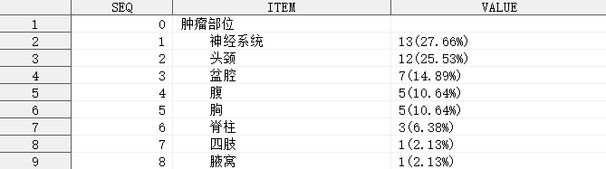
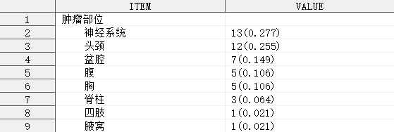

## 简介

单组单个定性指标的分析，输出频数、构成比（率）指标。

## 语法

### 必选参数

- [INDATA](#indata)
- [VAR](#var)

### 可选参数

- [PATTERN](#pattern)
- [BY](#by)
- [OUTDATA](#outdata)
- [STAT_FORMAT](#stat_format)
- [LABEL](#label)
- [INDENT](#indent)

## 参数说明

### INDATA

**Syntax** : <_libname._>_dataset_(_dataset-options_)

指定用于定性分析的数据集，可包含数据集选项

_libname_: 数据集所在的逻辑库名称

_dataset_: 数据集名称

_dataset-options_: 数据集选项，兼容 SAS 系统支持的所有数据集选项

**Example** :

```sas
INDATA = ADSL
INDATA = SHKY.ADSL
INDATA = SHKY.ADSL(where = (FAS = "Y"))
```

---

### VAR

**Syntax** :

- _variable_
- _variable_("_category-1_"<, "_category-2_", ...>)
- _variable_("_category-1_"<= "_note-1_"><, "_category-2_"<="_note-2_">, ...>)

指定定性分析的变量，_`category`_ 表示需要统计的分类名称，_`note`_ 表示该分类在输出数据集中的展示名称（可以与分类名称不同）。

**Caution** :

1. 参数 `VAR` 不允许指定不存在于参数 `INDATA` 指定的数据集中的变量；
2. 参数 `VAR` 不允许指定数值型变量；

**Tips** :

1. 参数 `VAR` 可以指定空字符串作为一个分类，在这种情况下，宏程序将计算缺失分类的频数，例如：`VAR = SEX("" = "缺失" "男" "女")`；

**Example** :

```sas
VAR = SEX
VAR = SEX("男" "女")
VAR = SEX("" = "Missing" "男" = "Male" "女" = "Female")
```

---

### PATTERN

**Syntax** : <_string(s)_>#_statistic-keyword-1_<_string(s)_><#_statistic-keyword-2_<_string(s)_>>

指定需计算的统计量及统计量的输出模式，输出模式定义了统计量是如何进行组合的，以及统计量在输出数据集中的位置。

其中，_`statistic-keyword`_ 可以指定以下统计量：

| 统计量 | 含义         |
| ------ | ------------ |
| RATE   | 构成比（率） |
| N      | 频数         |

_`string(s)`_ 可以是任意字符（串），若字符串含有字符 `#`，则使用 `##` 进行转义。

**Default** : `%nrstr(#N(#RATE))`

**Example** :

```sas
PATTERN = #N
PATTERN = #N[#RATE]##
```

---

### BY

**Syntax** :

- #FREQ_MAX|#FREQ_MIN
- _variable_<(ASC\<ENDING\>|DESC\<ENDING\>)>

指定各分类在输出数据集中的排列顺序。

**Default** : `#FREQ_MAX`

默认情况下，各分类按照频数从大到小排列，频数较大的分类将显示在输出数据集中靠前的位置。

**Caution** :

1. 若参数 `VAR` 指定了分析变量的分类名称，则按照各分类在参数 `VAR` 中指定的顺序显示在输出数据集中，此时参数 `BY` 无效。

**Example** :

```sas
BY = SEXN
```

---

### OUTDATA

**Syntax** : <_libname._>_dataset_(_dataset-options_)

指定统计结果输出的数据集，可包含数据集选项，用法同参数 [INDATA](#indata)。

输出数据集有 3 个变量，具体如下：

| 变量名 | 含义                                          |
| ------ | --------------------------------------------- |
| SEQ    | 行号                                          |
| ITEM   | 分类名称（展示名称）                          |
| VALUE  | 统计量在 [PATTERN](#pattern) 指定的模式下的值 |

其中，变量 `ITEM` 和 `VALUE` 默认输出到 `OUTDATA` 指定的数据集中，其余变量默认隐藏。

**Tips** :

如需显示隐藏的变量，可使用数据集选项实现，例如：`OUTDATA = T1(KEEP = SEQ ITEM VALUE)`

**Example** :

```sas
OUTDATA = T1
OUTDATA = T1(KEEP = (SEQ ITEM VALUE))
```

---

### STAT_FORMAT

**Syntax** : <(> #_statistic-keyword-1_ = _format-1_ <#_statistic-keyword-2_ = _format-2_> <...> <)>

指定输出结果中统计量的输出格式。

**Default** : (#N = BEST. #RATE = PERCENT9.2)

默认情况下，频数的输出格式为 `BEST.`，构成比（率）的输出格式为 `PERCENT9.2`，可通过参数 `STAT_FORMAT` 重新指定某个统计量的输出格式，_`statistic-keyword`_ 的用法详见 [PATTERN](#pattern)。

**Example** :

```sas
STAT_FORMAT = (#N = percent9.2 #RATE = 4.1)
```

---

### LABEL

**Syntax** : _string_

指定输出结果中第一行显示的标签。

**Default** : #AUTO

默认情况下，宏程序将自动获取变量 `VAR` 的标签，若标签为空，则使用变量 `VAR` 的变量名作为标签。

**Example** :

```sas
LABEL = "性别-n(%)"
```

---

### INDENT

**Syntax** : _string_

指定输出结果各分类的缩进字符串。

**Default** : #AUTO

默认情况下，各分类前使用 4 个英文空格作为缩进字符。

**Tips** :

1. 可以使用 RTF 控制符控制缩进，例如：五号字体下缩进 2 个中文字符，可指定参数 `INDENT = "\li420 "`

**Example** :

```sas
INDENT = "\li420 "
```

---

## 例子

### 打开帮助文档

```sas
%qualify();
%qualify(help);
```

### 一般用法

```sas
%qualify(indata = adsl, var = sex);
```


```sas
%qualify(indata = adsl, var = sex("" = "Missing", "男" = "Male", "女" = "Female"));
```


### 指定统计量的模式

```sas
%qualify(indata = adsl(where = (FASFL = "Y")), var = tuloc, by = #freq_max);
```


上述例子中，使用参数 `PATTERN` 改变了默认的统计量输出模式，构成比使用中括号[]包围，结尾使用 `##` 对 `#` 进行转义

### 指定分类排序方式

```sas
%qualify(indata = adsl(where = (FASFL = "Y")), var = tuloc, by = #freq_max);
```


### 指定需要保留的变量

```sas
%qualify(indata = adsl(where = (FASFL = "Y")), var = tuloc, outdata = t1(keep = seq item value));
```



### 指定统计量的输出格式

```sas
%qualify(indata = adsl(where = (FASFL = "Y")), var = tuloc, stat_format = (#N = 4.0 #RATE = 5.3));
```



### 指定分析变量标签

```sas
%qualify(indata = adsl(where = (FASFL = "Y")), var = tuloc, by = tulocn, label = "肿瘤部位，n(%)");
```


### 指定缩进字符串

```sas
%qualify(indata = adsl(where = (FASFL = "Y")), var = tuloc, by = tulocn, label = "肿瘤部位，n(%)", indent = "\li420 ");
```


上述例子中，使用参数 `INDENT` 指定了缩进字符串，如需使 RTF 控制符生效，需要在传送至 ODS 的同时，指定相关元素的 `PROTECTSPECIALCHAR` 属性值为 `OFF`。
