## 简介

单组单个定性指标的分析，输出频数、构成比（率）指标。

## 语法

### 必选参数

- [indata](#indata)
- [var](#var)

### 可选参数

- [by](#by)
- [uid](#uid)
- [pattern](#pattern)
- [missing](#missing)
- [missing_output](#missing_output)
- [missing_note](#missing_note)
- [missing_position](#missing_position)
- [outdata](#outdata)
- [stat_format](#stat_format)
- [label](#label)
- [indent](#indent)
- [suffix](#suffix)
- [total](#total)

### 调试参数

- [debug](#debug)

## 参数说明

### indata

**Syntax** : <_libname._>_dataset_(_dataset-options_)

指定用于定性分析的数据集，可包含数据集选项

_libname_: 数据集所在的逻辑库名称

_dataset_: 数据集名称

_dataset-options_: 数据集选项，兼容 SAS 系统支持的所有数据集选项

**Usage** :

```sas
indata = adsl
indata = adam.adsl
indata = adam.adsl(where = (fasfl = "Y"))
```

[**Example**](#一般用法)

---

### var

**Syntax** :

- _variable_
- _variable_("_category-1_" = "_note-1_" <, "_category-2_" ="_note-2_", ...>)

指定定性分析的变量。

_`category`_ 表示用于计算统计量的分类名称，_`note`_ 表示用于显示输出的分类名称。在你需要对某个特定分类的名称进行修改（例如：添加角标）时，_`note`_ 使得你在调用宏的时候就可以完成这一步骤。

> [!WARNING]
>
> - 参数 `var` 不允许指定不存在于参数 `indata` 指定的数据集中的变量；
> - 参数 `var` 不允许指定数值型变量；

**Usage** :

```sas
var = sex
var = sex("男" = "male", "女" = "female")
```

[**Example**](#一般用法)

---

### by

**Syntax** :

- #freq<(asc\<ending\> | desc\<ending\>)>
- _variable_<(asc\<ending\> | desc\<ending\>)>
- _format_<(asc\<ending\> | desc\<ending\>)>

指定各分类在输出数据集中的排列顺序依据。

**Default** : `#freq(descending)`

默认情况下，各分类按照频数从大到小排列，频数较大的分类将显示在输出数据集中靠前的位置。

> [!IMPORTANT]
>
> - 若参数 `by` 指定了基于某个输出格式进行排序，则该格式必须是 `catalog-based`，即在 `dictionary.formats` 表中，变量 `source` 的值应当是 `C`。
> - 当指定一个输出格式作为排序依据时，该输出格式应当使用 `value` 语句生成，例如：
>
>   ```sas
>   proc format;
>       value sexn
>           1 = "男"
>           2 = "女";
>   run;
>   ```
>
>   宏程序将根据格式化之前的数值对各分类进行排序。

**Usage** :

```sas
by = #freq
by = sexn(asc)
by = sexn.(descending)
```

[**Example**](#指定分类排序方式)

---

### uid

**Syntax** : _variable_ <_variable_, ...>

指定唯一标识符变量。宏程序将根据参数 `uid` 指定的变量对数据集进行去重，使用去重后的数据集统计频数，去重前的数据集统计频次。

`uid` 的值通常是能够标识观测所属 `频数统计对象` 的变量。

对 `频数统计对象` 的详细解释举例如下：

- 若数据集 `adsl` 的主键是 `usubjid`，需要统计性别 `sex` 的频数和频次，此时的 `频数统计对象` 是 `usubjid`，与主键相同，此时可以指定 `uid = usubjid`，也可以不指定 `uid`
- 若数据集 `adae` 的主键是 `usubjid aeseq`，需要统计不良事件的频数和频次，此时的 `频数统计对象` 是 `usubjid`，无法构成主键，需要指定 `uid = usubjid`
- 若数据集 `adlb` 的主键是 `usubjid param visit`，需要统计检查项目的频数和频次，此时的 `频数统计对象` 是 `usubjid param`，无法构成主键，需要指定 `uid = usubjid param`

> [!NOTE]
>
> - 在 `ADSL` 数据集中，`uid` 的值一般是 ` `（空值）
> - 在 `OCCDS` 数据集中，`uid` 的值一般是 `usubjid`
> - 在 `BDS` 数据集中，`uid` 的值一般是 `usubjid param`

**Default** : `#null`

默认情况下，宏程序将分析数据集中的每一条观测都视为不同统计对象的观测结果，在这种情况下，输出数据集中的频数和频次计算结果相同。

> [!IMPORTANT]
>
> - 由于默认不输出频次统计结果，因此还需要在参数 [outdata](#outdata) 中通过数据集选项指定显示频次统计结果，例如：`outdata = t1(keep = item value times)`。

**Usage** :

```sas
uid = usubjid
uid = usubjid param visit
```

[**Example**](#指定唯一标识符变量)

---

### pattern

**Syntax** : <_string(s)_>#_statistic-keyword-1_<_string(s)_><#_statistic-keyword-2_<_string(s)_>><...>

指定需计算的统计量及统计量的输出模式，输出模式定义了统计量是如何进行组合的，以及统计量在输出数据集中的位置。

其中，_`statistic-keyword`_ 可以指定以下统计量：

| 统计量  | 含义         |
| ------- | ------------ |
| `freq`  | 频数         |
| `times` | 频次         |
| `rate`  | 构成比（率） |

_`string(s)`_ 可以是任意字符（串），若字符串含有字符 `#`，则使用 `##` 进行转义。

**Default** : `%nrstr(#freq(#rate))`

**Usage** :

```sas
pattern = #freq
pattern = #freq[#rate]##
```

[**Example**](#指定统计量的输出模式)

---

### missing

**Syntax** : `true` | `false`

指定汇总统计时是否考虑缺失值。

**Default** : `false`

默认情况下，宏程序会在汇总统计前剔除缺失值，频数和频率的计算基于非缺失值。

若指定 `missing = true`，则缺失值也将被纳入汇总统计。

**Usage** :

```sas
missing = true
```

[**Example**](#指定是否统计缺失分类)

---

### missing_output

**Syntax** : `true` | `false`

指定是否输出缺失分类。

> [!IMPORTANT]
>
> 当指定 `missing = false` 时，该参数将被忽略。

**Default** : `true`

**Usage** :

```sas
missing_output = false
```

---

### missing_note

**Syntax** : _string_

指定缺失分类的的说明文字，该字符串必须使用匹配的单（双）引号包围。

如果指定的 `missing_note` 中含有不匹配的引号，例如，需要指定 `missing_note` 为一个单引号，可以选择以下传参方式：

```sas
missing_note = "'"
```

但不能使用以下传参方式：

```sas
missing_note = ''''
```

这与通常情况下“被成对的单引号包围的内部连续两个单引号被视为一个单引号”的语法略有不同。

> [!IMPORTANT]
>
> 当指定 `missing = false` 时，该参数将被忽略。

**Default** : `"缺失"`

**Usage** :

```sas
missing_note = "缺失-n(%)"
```

[**Example**](#指定缺失分类的说明文字)

---

### missing_position

**Syntax** : `first` | `last`

指定缺失分类在输出数据集中显示的位置。`first` 表示显示在所有分类前面，`last` 表示显示在所有分类后面。

> [!IMPORTANT]
>
> 当指定 `missing = false` 时，该参数将被忽略。

**Default** : `last`

**Usage** :

```sas
missing_position = first
```

[**Example**](#指定缺失分类的显示位置)

---

### outdata

**Syntax** : <_libname._>_dataset_(_dataset-options_)

指定统计结果输出的数据集，可包含数据集选项，用法同参数 [indata](#indata)。

输出数据集含有以下变量：

| 变量名        | 含义                                                |
| ------------- | --------------------------------------------------- |
| `idt`         | 缩进标识（_indent identifier_）                     |
| `seq`         | 行号                                                |
| `item_origin` | 分类名称（原始名称）                                |
| `item`        | 分类名称（展示名称）                                |
| `value`       | 统计量在 [pattern](#pattern) 指定的模式下的格式化值 |
| `freq`        | 频数                                                |
| `freq_fmt`    | 频数格式化值                                        |
| `times`       | 频次                                                |
| `times_fmt`   | 频次格式化值                                        |
| `rate`        | 频率                                                |
| `rate_fmt`    | 频率格式化值                                        |

其中：

- 若指定参数 [uid](#uid) = `#null` 或 ` `（空值），则默认输出变量 `item` 和 `value`
- 若指定参数 [uid](#uid) = _`variable`_，则默认输出变量 `item`, `value` 和 `times_fmt`

**Default** : `#auto`

默认情况下，输出数据集被命名为 `res_`_`var`_，其中 _`var`_ 为参数 [var](#var) 指定的变量的名称。

> [!TIP]
>
> - 如需显示隐藏的变量，可使用数据集选项实现，例如：`outdata = t1(keep = seq item value freq times)`

**Usage** :

```sas
outdata = t1
outdata = t1(keep = seq item value freq times)
```

[**Example**](#指定需要保留的变量)

**See Also** :

- [qualify_multi](../qualify_multi/readme.md#outdata)

---

### stat_format

**Syntax** : <(> #_statistic-keyword-1_ = _format-1_ <, #_statistic-keyword-2_ = _format-2_ <, ...>><)>

指定输出结果中统计量的输出格式。

其中，_`statistic-keyword`_ 可以指定以下统计量：

| 统计量            | 含义            | 默认值                 |
| ----------------- | --------------- | ---------------------- |
| `freq`            | 频数            | `best.`                |
| `times`           | 频次            | `best.`                |
| `rate`            | 构成比（率）    | `percentn9.2`          |
| `ts` <sup>1</sup> | 检验统计量      | _`#auto`_ <sup>2</sup> |
| `p` <sup>1</sup>  | 假设检验 _P_ 值 | _`#auto`_ <sup>3</sup> |

> [!IMPORTANT]
>
> - <sup>1</sup> 仅在宏 `%qualify_multi_test` 中可用；
>
> - <sup>2</sup> 检验统计量输出格式的默认值为 _`w.d`_，其中：
>
>   - _`w`_ = $\max\left(\left\lceil\log_{10}\left|s\right|\right\rceil, 1\right) + 6$， $s$ 表示检验统计量的值
>   - _`d`_ = 4
>
> - <sup>3</sup> 假设检验 _P_ 值输出格式的默认值为 `qlmt_pvalue.`，`qlmt_pvalue.` 由以下 `proc format` 过程定义：
>
>   ```sas
>   proc format;
>       picture qlmt_pvalue(round  max = 7)
>               low - < 0.0001 = "<0.0001"(noedit)
>               other = "9.9999";
>   run;
>   ```

**Usage** :

```sas
stat_format = (#freq = z4., #rate = percentn9.2)
stat_format = (#rate = qual., #ts = 8.4, #p = pv.)
```

[**Example**](#指定统计量的输出格式)

---

### label

**Syntax** : _string_

指定输出结果中第一行显示的标签字符串，该字符串必须使用匹配的单（双）引号包围。

如果指定的 `label` 中含有不匹配的引号，例如，需要指定 `label` 为一个单引号，可以选择以下传参方式：

```sas
label = "'"
```

但不能使用以下传参方式：

```sas
label = ''''
```

这与通常情况下“被成对的单引号包围的内部连续两个单引号被视为一个单引号”的语法略有不同。

**Default** : `#auto`

默认情况下，宏程序将自动获取变量 [var](#var) 的标签，若标签为空，则使用变量 [var](#var) 的变量名作为标签。

**Usage** :

```sas
label = "性别-n(%)"
```

[**Example**](#指定分析变量标签)

---

### indent

**Syntax** : _string_

指定输出结果各分类的缩进字符串，该字符串必须使用匹配的单（双）引号包围。

如果指定的 `indent` 中含有不匹配的引号，例如，需要指定 `indent` 为一个单引号，可以选择以下传参方式：

```sas
indent = "'"
```

但不能使用以下传参方式：

```sas
indent = ''''
```

这与通常情况下“被成对的单引号包围的内部连续两个单引号被视为一个单引号”的语法略有不同。

**Default** : `#auto`

默认情况下，各分类前使用 4 个英文空格作为缩进字符。

> [!TIP]
>
> - 可以使用 RTF 控制符控制缩进，例如：五号字体下缩进 2 个中文字符，可指定参数 `indent = "\li420 "`；

**Usage** :

```sas
indent = "\li420 "
```

[**Example**](#指定缩进字符串)

---

### suffix

**Syntax** : _string_

指定输出结果各分类名称的后缀，该字符串必须使用匹配的单（双）引号包围。

如果指定的 `suffix` 中含有不匹配的引号，例如，需要指定 `suffix` 为一个单引号，可以选择以下传参方式：

```sas
suffix = "'"
```

但不能使用以下传参方式：

```sas
suffix = ''''
```

这与通常情况下“被成对的单引号包围的内部连续两个单引号被视为一个单引号”的语法略有不同。

**Default** : `#auto`

默认情况下，各分类名称不添加后缀。

**Usage** :

```sas
suffix = "，n(%)"
```

[**Example**](#指定分类名称后缀)

---

### total

**Syntax** : `true` | `false`

指定是否在标签行输出各分类合计的统计结果。

**Default** : `false`

默认情况下，标签行仅显示参数 [label](#label) 指定的字符串，不显示各分类合计的统计结果。

**Usage** :

```sas
total = true
```

[**Example**](#指定分类名称后缀)

---

### debug

**Syntax** : `true` | `false`

指定是否删除宏程序运行过程生成的中间数据集。

**Default** : `false`

默认情况下，宏程序会自动删除运行过程生成的中间数据集。

> [!NOTE]
>
> 此参数用于开发者调试，一般无需关注。

---

## 例子

### 打开帮助文档

```sas
%qualify();
%qualify(help);
```

### 一般用法

```sas
%qualify(indata = adam.adsl(where = (FASFL = "Y")), var = ecgcsig);
```

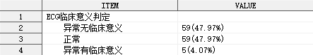

```sas
%qualify(indata = adam.adsl(where = (FASFL = "Y")), var = ecgcsig("异常无临床意义" = "NCS", "异常有临床意义" = "CS"));
```

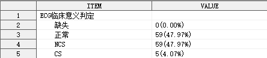

### 指定统计量的输出模式

```sas
%qualify(indata = adam.adsl(where = (FASFL = "Y")), var = ecgcsig, pattern = %str(#freq[#rate]##));
```

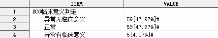

上述例子中，使用参数 `pattern` 改变了默认的统计量输出模式，构成比使用中括号 `[]` 包围，结尾使用 `##` 对 `#` 进行转义。

### 指定分类排序方式

```sas
%qualify(indata = adam.adsl(where = (FASFL = "Y")), var = ecgcsig, by = #freq(desc));
```

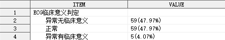

```sas
%qualify(indata = adam.adsl(where = (FASFL = "Y")), var = ecgcsig, by = ecgcsign);
```

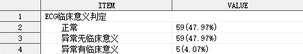

```sas
%qualify(indata = adam.adsl(where = (FASFL = "Y")), var = ecgcsig, by = clsig.);
```

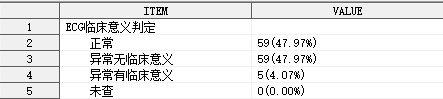

输出格式 `clsig.` 包含的具体分类如下：

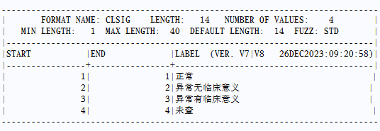

### 指定唯一标识符变量

```sas
%qualify(indata  = adam.addv(where = (FASFL = "Y")),
         var     = dvtype,
         uid     = usubjid,
         outdata = t1(keep = item value freq times));
```

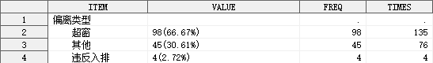

### 指定是否统计缺失分类

```sas
%qualify(indata  = adam.adsl(where = (FASFL = "Y")),
         var     = ecgcsig,
         by      = clsig.,
         missing = true);
```

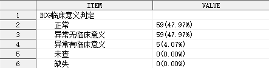

### 指定缺失分类的说明文字

```sas
%qualify(indata       = adam.adsl(where = (FASFL = "Y")),
         var          = ecgcsig,
         by           = clsig.,
         missing      = true,
         missing_note = "不适用");
```

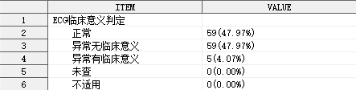

### 指定缺失分类的显示位置

```sas
%qualify(indata           = adam.adsl(where = (FASFL = "Y")),
         var              = ecgcsig,
         by               = clsig.,
         missing          = true,
         missing_note     = "不适用",
         missing_position = first);
```

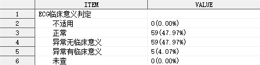

### 指定需要保留的变量

```sas
%qualify(indata  = adam.adsl(where = (FASFL = "Y")),
         var     = ecgcsig,
         by      = clsig.,
         missing = true,
         outdata = t1(keep = seq item value n rate));
```

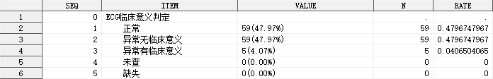

### 指定统计量的输出格式

```sas
%qualify(indata     = adam.adsl(where = (FASFL = "Y")),
        var         = ecgcsig,
        by          = clsig.,
        missing     = true,
        stat_format = (#freq = z4., #rate = 5.3));
```

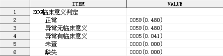

### 指定分析变量标签

```sas
%qualify(indata  = adam.adsl(where = (FASFL = "Y")),
         var     = ecgcsig,
         by      = clsig.,
         missing = true,
         label   = "ECG 临床意义判定-n(%)");
```

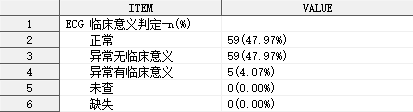

### 指定缩进字符串

```sas
%qualify(indata  = adam.adsl(where = (FASFL = "Y")),
         var     = ecgcsig,
         by      = clsig.,
         missing = true,
         label   = "ECG 临床意义判定-n(%)",
         indent  = "\li420 ");
```

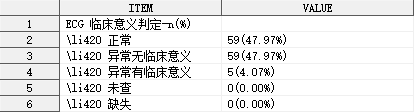

上述例子中，使用参数 `indent` 指定了 RTF 控制符 `\li420` 作为缩进字符串。如需使 RTF 控制符生效，需要在传送至 ODS 的同时，指定相关元素的 `protectspecialchars` 属性值为 `off`。

### 指定分类名称后缀

```sas
%qualify(indata  = adam.adsl(where = (FASFL = "Y")),
         var     = ecgcsig,
         by      = clsig.,
         missing = true,
         label   = "ECG 临床意义判定",
         indent  = "\li420 ",
         suffix  = "，n(%)");
```

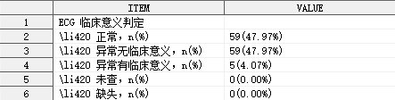

### 指定是否输出各分类合计的统计结果

```sas
%qualify(indata  = adam.adsl(where = (FASFL = "Y")),
         var     = ecgcsig,
         by      = clsig.,
         missing = true,
         label   = "ECG 临床意义判定",
         indent  = "\li420 ",
         suffix  = "，n(%)",
         total   = true);
```

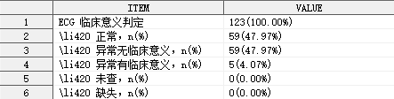
