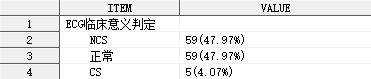
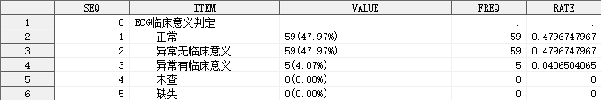

## 简介

单组单个定性指标的分析，输出频数、构成比（率）指标。

## 语法

### 必选参数

- [INDATA](#indata)
- [VAR](#var)

### 可选参数

- [PATTERN](#pattern)
- [BY](#by)
- [MISSING](#missing)
- [MISSING_NOTE](#missing_note)
- [MISSING_POSITION](#missing_position)
- [OUTDATA](#outdata)
- [STAT_FORMAT](#stat_format)
- [LABEL](#label)
- [INDENT](#indent)
- [SUFFIX](#suffix)

### 调试参数

- [DEL_TEMP_DATA](#del_temp_data)

## 参数说明

### INDATA

**Syntax** : <_libname._>_dataset_(_dataset-options_)

指定用于定性分析的数据集，可包含数据集选项

_libname_: 数据集所在的逻辑库名称

_dataset_: 数据集名称

_dataset-options_: 数据集选项，兼容 SAS 系统支持的所有数据集选项

**Example** :

```sas
INDATA = ADSL
INDATA = SHKY.ADSL
INDATA = SHKY.ADSL(where = (FAS = "Y"))
```

---

### VAR

**Syntax** :

- _variable_
- _variable_("_category-1_"<, "_category-2_", ...>)
- _variable_("_category-1_"<= "_note-1_"><, "_category-2_"<="_note-2_">, ...>)

指定定性分析的变量，_`category`_ 表示需要统计的分类名称，_`note`_ 表示该分类在输出数据集中的展示名称（可以与分类名称不同）。

**Caution** :

1. 参数 `VAR` 不允许指定不存在于参数 `INDATA` 指定的数据集中的变量；
2. 参数 `VAR` 不允许指定数值型变量；

**Tips** :

1. 参数 `VAR` 可以指定空字符串作为一个分类，在这种情况下，宏程序将计算缺失分类的频数，例如：`VAR = SEX("" = "缺失" "男" "女")`；

**Example** :

```sas
VAR = SEX
VAR = SEX("男" "女")
VAR = SEX("" = "Missing" "男" = "Male" "女" = "Female")
```

---

### PATTERN

**Syntax** : <_string(s)_>#_statistic-keyword-1_<_string(s)_><#_statistic-keyword-2_<_string(s)_>><...>

指定需计算的统计量及统计量的输出模式，输出模式定义了统计量是如何进行组合的，以及统计量在输出数据集中的位置。

其中，_`statistic-keyword`_ 可以指定以下统计量：

| 统计量 | 含义         |
| ------ | ------------ |
| RATE   | 构成比（率） |
| N      | 频数         |

_`string(s)`_ 可以是任意字符（串），若字符串含有字符 `#`，则使用 `##` 进行转义。

**Default** : `%nrstr(#N(#RATE))`

**Example** :

```sas
PATTERN = #N
PATTERN = #N[#RATE]##
```

---

### BY

**Syntax** :

- #FREQ<(ASC\<ENDING\>|DESC\<ENDING\>)>
- _variable_<(ASC\<ENDING\>|DESC\<ENDING\>)>
- _format_<(ASC\<ENDING\>|DESC\<ENDING\>)>

指定各分类在输出数据集中的排列顺序依据。

**Default** : #FREQ(DESCENDING)

默认情况下，各分类按照频数从大到小排列，频数较大的分类将显示在输出数据集中靠前的位置。

当指定一个输出格式作为排序依据时，该输出格式应当使用 `VALUE` 语句生成，例如：

```sas
proc format;
    value sexn
        1 = "男"
        2 = "女";
run;
```

宏程序将根据格式化之前的数值对各分类进行排序。

**Caution** :

1. 若参数 `VAR` 指定了分析变量的分类名称，则按照各分类在参数 `VAR` 中指定的顺序显示在输出数据集中，此时参数 `BY` 无效；
2. 若参数 `BY` 指定了基于某个输出格式进行排序，则该格式必须是 CATALOG-BASED，即在 `DICTIONARY.FORMATS` 表中，变量 `source` 的值应当是 `C`。

**Example** :

```sas
BY = #freq
BY = SEXN(asc)
BY = SEXN.(descending)
```

---

### MISSING

**Syntax** : TRUE|FALSE

指定是否统计缺失分类。

**Default** : FALSE

默认情况下，宏程序不统计缺失分类的频数和频率。

**Example** :

```sas
MISSING = TRUE
```

---

### MISSING_NOTE

**Syntax** : _string(s)_

指定缺失分类的的说明文字，可以使用或不使用引号包围。

当指定 `MISSING = FALSE` 时，该参数将被忽略。

**Default** : "缺失"

**Example** :

```sas
MISSING_NOTE = "缺失"
MISSING_NOTE = '缺失'
MISSINF_NOTE = %str(缺失)
```

---

### MISSING_POSITION

**Syntax** : FIRST|LAST

指定缺失分类在输出数据集中显示的位置。FIRST 表示显示在所有分类前面，LAST 表示显示在所有分类后面。

当指定 `MISSING = FALSE` 时，该参数将被忽略。

**Default** : LAST

**Example** :

```sas
MISSING_POSITION = FIRST
```

---

### OUTDATA

**Syntax** : <_libname._>_dataset_(_dataset-options_)

指定统计结果输出的数据集，可包含数据集选项，用法同参数 [INDATA](#indata)。

输出数据集有 7 个变量，具体如下：

| 变量名   | 含义                                          |
| -------- | --------------------------------------------- |
| SEQ      | 行号                                          |
| ITEM     | 分类名称（展示名称）                          |
| VALUE    | 统计量在 [PATTERN](#pattern) 指定的模式下的值 |
| N        | 频数                                          |
| N_FMT    | 频数格式化值                                  |
| RATE     | 频率                                          |
| RATE_FMT | 频率格式化值                                  |

其中，变量 `ITEM` 和 `VALUE` 默认输出到 `OUTDATA` 指定的数据集中，其余变量默认隐藏。

**Default** : #AUTO

默认情况下，输出数据集被命名为 `RES_`_`var`_，其中 _`var`_ 为参数 [VAR](#var) 指定的变量的名称。

**Tips** :

如需显示隐藏的变量，可使用数据集选项实现，例如：`OUTDATA = T1(KEEP = SEQ ITEM VALUE)`

**Example** :

```sas
OUTDATA = T1
OUTDATA = T1(KEEP = (SEQ ITEM VALUE))
```

---

### STAT_FORMAT

**Syntax** : <(> #_statistic-keyword-1_ = _format-1_ <, #_statistic-keyword-2_ = _format-2_ <, ...>><)>

指定输出结果中统计量的输出格式。

**Default** : (#N = BEST. #RATE = PERCENT9.2)

默认情况下，频数的输出格式为 `BEST.`，构成比（率）的输出格式为 `PERCENT9.2`，可通过参数 `STAT_FORMAT` 重新指定某个统计量的输出格式，_`statistic-keyword`_ 的用法详见 [PATTERN](#pattern)。

**Example** :

```sas
STAT_FORMAT = (#N = percent9.2, #RATE = 4.1)
```

---

### LABEL

**Syntax** : _string_

指定输出结果中第一行显示的标签，以下三种传参方式都是可接受的：

- `LABEL = "`_`string`_`"`
- `LABEL = '`_`string`_`'`
- `LABEL = `_`string`_

如果指定的 `LABEL` 中含有不匹配的引号，例如，需要指定 `LABEL` 为一个单引号，可以选择以下传参方式：

```sas
LABEL = "'"
LABEL = %str(%')
```

但不能使用以下传参方式：

```sas
LABEL = ''''
```

⚠ 尽管在一般情况下，由单引号包围的字符串中，连续两个单引号被视为一个单引号，但在本宏程序中，由于技术限制，连续两个单引号仍然被视为两个单引号；同理，在由双引号包围的字符串中，连续两个双引号仍然被视为两个双引号。

**Default** : #AUTO

默认情况下，宏程序将自动获取变量 [VAR](#var) 的标签，若标签为空，则使用变量 [VAR](#var) 的变量名作为标签。

**Example** :

```sas
LABEL = "性别-n(%)"
```

---

### INDENT

**Syntax** : _string_

指定输出结果各分类的缩进字符串，以下三种传参方式都是可接受的：

- `INDENT = "`_`string`_`"`
- `INDENT = '`_`string`_`'`
- `INDENT = `_`string`_

如果指定的 `INDENT` 中含有不匹配的引号，例如，需要指定 `INDENT` 为一个单引号，可以选择以下传参方式：

```sas
INDENT = "'"
INDENT = %str(%')
```

但不能使用以下传参方式：

```sas
INDENT = ''''
```

⚠ 尽管在一般情况下，由单引号包围的字符串中，连续两个单引号被视为一个单引号，但在本宏程序中，由于技术限制，连续两个单引号仍然被视为两个单引号；同理，在由双引号包围的字符串中，连续两个双引号仍然被视为两个双引号。

**Default** : #AUTO

默认情况下，各分类前使用 4 个英文空格作为缩进字符。

**Tips** :

1. 可以使用 RTF 控制符控制缩进，例如：五号字体下缩进 2 个中文字符，可指定参数 `INDENT = "\li420 "`；

**Example** :

```sas
INDENT = "\li420 "
```

---

### SUFFIX

**Syntax** : _string_

指定输出结果各分类名称的后缀，以下三种传参方式都是可接受的：

- `SUFFIX = "`_`string`_`"`
- `SUFFIX = '`_`string`_`'`
- `SUFFIX = `_`string`_

如果指定的 `SUFFIX` 中含有不匹配的引号，例如，需要指定 `SUFFIX` 为一个单引号，可以选择以下传参方式：

```sas
SUFFIX = "'"
SUFFIX = %str(%')
```

但不能使用以下传参方式：

```sas
SUFFIX = ''''
```

⚠ 尽管在一般情况下，由单引号包围的字符串中，连续两个单引号被视为一个单引号，但在本宏程序中，由于技术限制，连续两个单引号仍然被视为两个单引号；同理，在由双引号包围的字符串中，连续两个双引号仍然被视为两个双引号。

**Default** : #AUTO

默认情况下，各分类名称不添加后缀。

**Example** :

```sas
SUFFIX = "，n(%)"
```

---

### DEL_TEMP_DATA

**Syntax** : TRUE|FALSE

指定是否删除宏程序运行过程生成的中间数据集。

**Default** : TRUE

默认情况下，宏程序会自动删除运行过程生成的中间数据集。

⚠ 此参数用于开发者调试，一般无需关注。

---

## 例子

### 打开帮助文档

```sas
%qualify();
%qualify(help);
```

### 一般用法

```sas
%qualify(indata = adam.adsl(where = (FASFL = "Y")), var = ecgcsig);
```


```sas
%qualify(indata = adam.adsl(where = (FASFL = "Y")), var = ecgcsig("正常", "异常无临床意义", "异常有临床意义"));
```


```sas
%qualify(indata = adam.adsl(where = (FASFL = "Y")), var = ecgcsig("" = "缺失", "正常", "异常无临床意义" = "NCS", "异常有临床意义" = "CS"));
```



### 指定统计量的模式

```sas
%qualify(indata = adam.adsl(where = (FASFL = "Y")), var = ecgcsig, pattern = %str(#n[#rate]##));
```


上述例子中，使用参数 `PATTERN` 改变了默认的统计量输出模式，构成比使用中括号[]包围，结尾使用 `##` 对 `#` 进行转义。

### 指定分类排序方式

```sas
%qualify(indata = adam.adsl(where = (FASFL = "Y")), var = ecgcsig, by = #freq(desc));
```


```sas
%qualify(indata = adam.adsl(where = (FASFL = "Y")), var = ecgcsig, by = ecgcsign);
```


```sas
%qualify(indata = adam.adsl(where = (FASFL = "Y")), var = ecgcsig, by = clsig.);
```


输出格式 `clsig.` 包含的具体分类如下：


### 指定是否统计缺失分类

```sas
%qualify(indata = adam.adsl(where = (FASFL = "Y")), var = ecgcsig, by = clsig., missing = true);
```


### 指定缺失分类的说明文字

```sas
%qualify(indata = adam.adsl(where = (FASFL = "Y")), var = ecgcsig, by = clsig., missing = true, missing_note = "不适用");
```


### 指定缺失分类的显示位置

```sas
%qualify(indata = adam.adsl(where = (FASFL = "Y")), var = ecgcsig, by = clsig., missing = true, missing_note = "不适用", missing_position = first);
```


### 指定需要保留的变量

```sas
%qualify(indata = adam.adsl(where = (FASFL = "Y")), var = ecgcsig, by = clsig., missing = true, outdata = t1(keep = seq item value n rate));
```



### 指定统计量的输出格式

```sas
%qualify(indata = adam.adsl(where = (FASFL = "Y")), var = ecgcsig, by = clsig., missing = true, stat_format = (#N = z4., #RATE = 5.3));
```


### 指定分析变量标签

```sas
%qualify(indata = adam.adsl(where = (FASFL = "Y")), var = ecgcsig, by = clsig., missing = true, label = "ECG 临床意义判定-n(%)");
```


### 指定缩进字符串

```sas
%qualify(indata = adam.adsl(where = (FASFL = "Y")), var = ecgcsig, by = clsig., missing = true, label = "ECG 临床意义判定-n(%)", indent = "\li420 ");
```


上述例子中，使用参数 `INDENT` 指定了 RTF 控制符 `\li420` 作为缩进字符串。如需使 RTF 控制符生效，需要在传送至 ODS 的同时，指定相关元素的 `PROTECTSPECIALCHAR` 属性值为 `OFF`。

### 指定分类名称后缀

```sas
%qualify(indata = adam.adsl(where = (FASFL = "Y")), var = ecgcsig, by = clsig., missing = true, label = "ECG 临床意义判定", indent = "\li420 ", suffix = "，n(%)");
```


