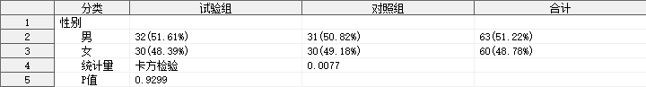

## 简介

多组单个定性指标的分析，输出频数、频率等指标，并进行卡方检验或 Fisher 精确检验。

## 语法

### 必选参数

- [INDATA](#indata)
- [VAR](#var)
- [GROUP](#group)
- [GROUPBY](#groupby)

### 可选参数

- [PATTERN](#pattern)
- [OUTDATA](#outdata)
- [STAT_FORMAT](#stat_format)
- [STAT_NOTE](#stat_note)
- [LABEL](#label)
- [INDENT](#indent)
- [SUFFIX](#suffix)
- [T_FORMAT](#t_format)
- [P_FORMAT](#p_format)
- [PROCHTTP_PROXY](#prochttp_proxy)

### 调试参数

- [DEL_TEMP_DATA](#del_temp_data)

## 参数说明

### INDATA

用法同 [INDATA](../qualify/readme.md#indata)。

---

### VAR

用法同 [VAR](../qualify/readme.md#var)。

---

### GROUP

**Syntax** : _variable_

指定分组变量。

**Caution** :

1. 参数 `GROUP` 不允许指定不存在于参数 `INDATA` 指定的数据集中的变量；
2. 参数 `GROUP` 不允许指定数值型变量；

**Example** :

```sas
GROUP = ARM
```

---

### GROUPBY

**Syntax** : _variable_

指定分组变量的排序。

**Caution** :

1. 参数 `GROUPBY` 不允许指定不存在于参数 `INDATA` 指定的数据集中的变量；

**Example** :

```sas
GROUPBY = ARMN
```

---

### OUTDATA

**Syntax** : <_libname._>_dataset_(_dataset-options_)

指定统计结果输出的数据集，可包含数据集选项，用法同参数 [INDATA](#indata)。

输出数据集有 _m_ + 3 个变量，其中 _m_ 为参数 GROUP 指定的分组变量的水平数，具体如下：

| 变量名     | 含义                                                                   |
| ---------- | ---------------------------------------------------------------------- |
| SEQ        | 行号                                                                   |
| ITEM       | 指标名称                                                               |
| VALUE\__i_ | 统计量在 [PATTERN](#pattern) 指定的模式下的值（GROUP 的第 _i_ 个水平） |
| VALUE_SUM  | 统计量在 [PATTERN](#pattern) 指定的模式下的值（GROUP 的所有水平合计）  |

其中，变量 `ITEM`、`VALUE_`_`i`_、`VALUE_SUM` 默认输出到 `OUTDATA` 指定的数据集中，其余变量默认隐藏。

⚠ 当 GROUP 的水平数量为 1 时，变量 VALUE_SUM 默认隐藏。

**Default** : RES\_&_VAR_

默认情况下，输出数据集的名称为 `RES_`_`var`_，其中 `var` 为参数 [VAR](#var) 指定的变量名。

**Tips** :

如需显示隐藏的变量，可使用数据集选项实现，例如：`OUTDATA = T1(KEEP = SEQ ITEM VALUE_1 VALUE_2 VALUE_SUM)`

**Example** :

```sas
OUTDATA = T1
OUTDATA = T1(KEEP = SEQ ITEM VALUE_1 VALUE_2 VALUE_SUM)
```

---

### PATTERN

用法同 [PATTERN](../qualify/readme.md#pattern)。

---

### BY

用法同 [BY](../qualify/readme.md#by)。

---

### STAT_FORMAT

用法同 [STAT_FORMAT](../qualify/readme.md#stat_format)。

---

### LABEL

用法同 [LABEL](../qualify/readme.md#label)。

---

### INDENT

用法同 [INDENT](../qualify/readme.md#indent)。

---

### SUFFIX

用法同 [SUFFIX](../qualify/readme.md#suffix)。

---

### T_FORMAT

**Syntax** : _format_

指定卡方统计量的输出格式。

**Default** : #AUTO

默认情况下，宏程序会自动计算合适的统计量的输出格式 _w.d_，其中：

- _w_ = $\max(\lceil\log_{10}\left|s\right|\rceil, 7)$， $s$ 表示检验统计量的值
- _d_ = 4

**Example** :

```sas
T_FORMAT = 8.3
```

---

### P_FORMAT

**Syntax** : _format_

指定 P 值的输出格式。

**Default** : #AUTO

默认情况下，宏程序使用 `spvalue.` 作为 P 值的输出格式，生成输出格式 `spvalue.` 的代码如下：

```sas
proc format;
    picture spvalue(round  max = 7)
            low - < 0.0001 = "<0.0001"(noedit)
            other = "9.9999";
run;
```

**Example** :

```sas
F_FORMAT = 8.3
```

---

### PROCHTTP_PROXY

**Syntax** : _host_:_port_

指定代理主机和端口。

本宏程序将自动检查前置依赖程序是否已经导入，若发现前置依赖程序未导入，则尝试从网络上下载最新版本程序文件，使用此参数可指定网络连接使用的代理主机和端口。

**Default** : 127.0.0.1:7890

---

### DEL_TEMP_DATA

**Syntax** : TRUE|FALSE

指定是否删除宏程序运行过程生成的中间数据集。

**Default** : TRUE

默认情况下，宏程序会自动删除运行过程生成的中间数据集。

⚠ 此参数用于开发者调试，一般无需关注。

⚠ 本宏程序内部调用的依赖宏程序 `%qualify_multi` 运行过程中生成的中间数据集无法通过此参数控制，在退出 `%qualify_multi` 时，这些中间数据集默认被删除，如需单独调试宏程序 `%qualify_multi`，请单独调用 `%qualify_multi` 并指定 `DEL_TEMP_DATA = FALSE`。

---

## 例子

### 打开帮助文档

```sas
%qualify_multi_test();
%qualify_multi_test(help);
```

### 一般用法

```sas
%qualify_multi_test(indata = adam.adsl(where = (fasfl = "Y")), var = sex, group = arm, groupby = armn);
```


