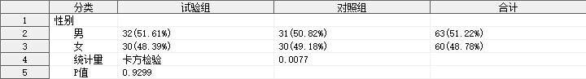

## 简介

多组单个定性指标的分析，输出频数、构成比（率）指标，并进行卡方检验或 _fisher_ 精确检验。

## 语法

### 必选参数

- [indata](#indata)
- [var](#var)
- [group](#group)

### 可选参数

- [groupby](#groupby)
- [by](#by)
- [uid](#uid)
- [pattern](#pattern)
- [missing](#missing)
- [missing_output](#missing_output)
- [missing_note](#missing_note)
- [missing_position](#missing_position)
- [outdata](#outdata)
- [stat_format](#stat_format)
- [label](#label)
- [indent](#indent)
- [suffix](#suffix)
- [chisq_note](#chisq_note)
- [fisher_note](#fisher_note)
- [fisher_stat_ph](#fisher_stat_ph)

### 调试参数

- [debug](#debug)

## 参数说明

### indata

用法同 [indata](../qualify/readme.md#indata)。

---

### var

用法同 [var](../qualify/readme.md#var)。

---

### group

用法同 [group](../qualify_multi/readme.md#group)

---

### groupby

用法同 [groupby](../qualify_multi/readme.md#groupby)

---

### by

用法同 [by](../qualify/readme.md#by)。

---

### uid

用法同 [uid](../qualify/readme.md#uid)。

---

### pattern

用法同 [pattern](../qualify/readme.md#pattern)。

---

### missing

用法同 [missing](../qualify/readme.md#missing)。

---

### missing_output

用法同 [missing_output](../qualify/readme.md#missing_output)。

---

### missing_note

用法同 [missing_note](../qualify/readme.md#missing_note)。

---

### missing_position

用法同 [missing_position](../qualify/readme.md#missing_position)。

---

### outdata

用法同 [outdata](../qualify_multi/readme.md#outdata)。

---

### stat_format

用法同 [stat_format](../qualify/readme.md#stat_format)。

---

### label

用法同 [label](../qualify/readme.md#label)。

---

### indent

用法同 [indent](../qualify/readme.md#indent)。

---

### suffix

用法同 [suffix](../qualify/readme.md#suffix)。

---

### chisq_note

**Syntax** : _string_

指定输出结果中卡方检验方法显示的字符串，该字符串必须使用匹配的单（双）引号包围。

> [!NOTE]
>
> 该选项仅在使用卡方检验时生效。

**Default** : `"卡方检验"`

**Usage** :

```sas
chisq_note = "χ\super 2 \nosupersub 检验"
```

### fisher_note

**Syntax** : _string_

指定输出结果中 _fisher_ 精确检验方法显示的字符串，该字符串必须使用匹配的单（双）引号包围。

> [!NOTE]
>
> 该选项仅在使用 _fisher_ 精确检验时生效。

**Default** : `"Fisher精确检验"`

**Usage** :

```sas
fisher_note = "Fisher"
```

### fisher_stat_ph

**Syntax** : _string_

指定输出结果中 _fisher_ 精确检验统计量显示的占位字符串，该字符串必须使用匹配的单（双）引号包围。

> [!NOTE]
>
> 该选项仅在使用 _fisher_ 精确检验时生效。

**Default** : `""`

**Usage** :

```sas
fisher_stat_ph = "-"
```

---

### debug

**Syntax** : `true` | `false`

指定是否删除宏程序运行过程生成的中间数据集。

**Default** : `false`

默认情况下，宏程序会自动删除运行过程生成的中间数据集。

> [!NOTE]
>
> - 此参数用于开发者调试，一般无需关注。
> - 本宏程序内部调用的依赖宏程序 `%qualify_multi` 运行过程中生成的中间数据集无法通过此参数控制，在退出 `%qualify_multi` 时，这些中间数据集默认被删除，如需单独调试宏程序 `%qualify_multi`，请单独调用 `%qualify_multi` 并指定 `debug = true`。

---

## 例子

### 打开帮助文档

```sas
%qualify_multi_test();
%qualify_multi_test(help);
```

### 一般用法

```sas
%qualify_multi_test(indata = adam.adsl(where = (fasfl = "Y")), var = sex, group = arm, groupby = armn);
```


