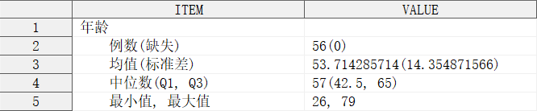
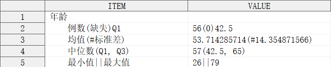
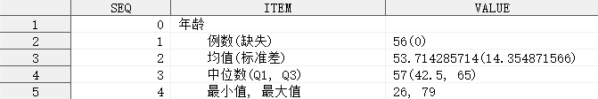
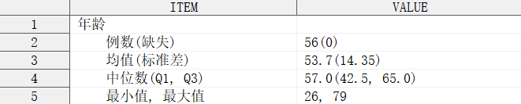
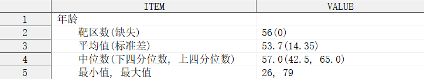
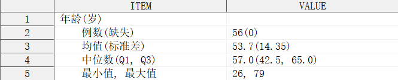

## 简介

单组单个定量指标的分析，输出均值、中位数、标准差、最大值、最小值、Q1、Q3 等指标。

## 语法

### 必选参数

- [indata](#indata)
- [var](#var)

### 可选参数

- [pattern](#pattern)
- [outdata](#outdata)
- [stat_format](#stat_format)
- [stat_note](#stat_note)
- [label](#label)
- [indent](#indent)

### 调试参数

- [debug](#debug)

## 参数说明

### indata

**Syntax** : <_libname._>_dataset_(_dataset-options_)

指定用于定量分析的数据集，可包含数据集选项

_libname_: 数据集所在的逻辑库名称

_dataset_: 数据集名称

_dataset-options_: 数据集选项，兼容 SAS 系统支持的所有数据集选项

**Usage** :

```sas
indata = adsl
indata = adam.adsl
indata = adam.adsl(where = (fasfl = "Y"))
```

[**Example**](#一般用法)

---

### var

**Syntax** : _variable_

指定定量分析的变量。

> [!WARNING]
>
> - 参数 `var` 不允许指定不存在于参数 `indata` 指定的数据集中的变量；
> - 参数 `var` 不允许指定字符型变量；

**Usage** :

```sas
var = age
```

[**Example**](#一般用法)

---

### pattern

**Syntax** : _row-1-specification_<|_row-2-specification_<|...>>

指定需计算的统计量及统计量的输出模式，输出模式定义了统计量是如何进行组合的，以及统计量在输出数据集中的位置。

_`row-i-specification`_ 表示输出数据集中第 _`i`_`+ 1` 行（第 1 行固定为分析变量的标签）的统计量结果展示模式，输出数据集中的每一行均用一个 _`row-i-specification`_ 进行定义，不同行的定义之间使用字符 `|` 隔开，其中 _`row-i-specification`_ 的语法如下：

- _string(s)_
- #_statistic-keyword_
- <_string(s)_>#_statistic-keyword_<_string(s)_>
- <_string(s)_>#_statistic-keyword-1_<_string(s)_><#_statistic-keyword-2_><_string(s)_><...>

_`statistic-keyword`_ 可以指定以下统计量：

| 统计量     | 简写   | 含义               |
| ---------- | ------ | ------------------ |
| `n`        |        | 例数               |
| `nmiss`    |        | 缺失               |
| `mean`     |        | 均值               |
| `var`      |        | 方差               |
| `stddev`   | `std`  | 标准差             |
| `stderr`   |        | 标准误             |
| `range`    |        | 极差               |
| `median`   |        | 中位数             |
| `mode`     |        | 众数               |
| `q1`       |        | 下四分位数         |
| `q3`       |        | 上四分位数         |
| `qrange`   |        | 四分位间距         |
| `min`      |        | 最小值             |
| `max`      |        | 最大值             |
| `cv`       |        | 变异系数           |
| `kurtosis` | `kurt` | 峰度               |
| `skewness` | `skew` | 偏度               |
| `lclm`     |        | 均值的 95%置信下限 |
| `uclm`     |        | 均值的 95%置信上限 |
| `sum`      |        | 总和               |
| `uss`      |        | 未校正平方和       |
| `css`      |        | 校正平方和         |
| `p1`       |        | 第 1 百分位数      |
| `p5`       |        | 第 5 百分位数      |
| `p10`      |        | 第 10 百分位数     |
| `p20`      |        | 第 20 百分位数     |
| `p25`      |        | 第 25 百分位数     |
| `p30`      |        | 第 30 百分位数     |
| `p40`      |        | 第 40 百分位数     |
| `p50`      |        | 第 50 百分位数     |
| `p60`      |        | 第 60 百分位数     |
| `p70`      |        | 第 70 百分位数     |
| `p75`      |        | 第 75 百分位数     |
| `p80`      |        | 第 80 百分位数     |
| `p90`      |        | 第 90 百分位数     |
| `p95`      |        | 第 95 百分位数     |
| `p99`      |        | 第 99 百分位数     |

_`string(s)`_ 可以是任意字符（串），若字符串含有字符 `|`，则使用 `#|` 进行转义，若字符串含有字符 `#`，则使用 `##` 进行转义。

**Default** : `%nrstr(#n(#nmiss)|#mean(#std)|#median(#q1, #q3)|#min, #max)`

> [!IMPORTANT]
>
> - 若紧跟在 _statistic-keyword_ 之后的 _string(s)_ 的部分字符与 _statistic-keyword_ 可以组合成另一个 _statistic-keyword_，为了避免混淆，应当在 _statistic-keyword_ 后添加一个 `.`，然后再添加 _string(s)_。例如：`pattern = #n(#n.miss)|#mean(#std)`，其中 `#n.miss` 代表将计算例数与字符串 `miss` 进行连接；
> - 若 #_statistic-keyword_ 之后的第一个字符是 `.`，则需要使用 `..` 才能正确表示。例如：`pattern = #n(#n..miss)|#mean(#std)`；
> - 若 #_statistic-keyword_ 之前的第一个字符是 `.`，则需要使用 `..` 才能正确表示。例如：`pattern = ..#mean`；
> - 若 #_statistic-keyword_ 之前的第一个字符是 `#`，则需要使用 `##.` 才能正确表示。例如：`pattern = ##.#mean`；
> - 若未指定任何 _statistic-keyword_，则会直接输出原始字符串，而不进行任何统计量的计算。

**Usage** :

```sas
pattern = #n(#nmiss)|#mean±#std|#median(#q1, #q3)|#min, #max
pattern = #n(#nmiss)|#mean(##.#std)|#median(#q1, #q3)|#min#|#|#max|#kurtosis, #skewness|(#lclm, #uclm)
```

[**Example**](#指定统计量的输出模式)

---

### outdata

**Syntax** : <_libname._>_dataset_(_dataset-options_)

指定统计结果输出的数据集，可包含数据集选项，用法同参数 [indata](#indata)。

输出数据集含有以下变量：

| 变量名  | 含义                                          |
| ------- | --------------------------------------------- |
| `seq`   | 行号                                          |
| `item`  | 指标名称                                      |
| `value` | 统计量在 [pattern](#pattern) 指定的模式下的值 |

其中，变量 `item` 和 `value` 默认输出到 `outdata` 指定的数据集中，其余变量默认隐藏。

**Default** : `res_`_`var`_

默认情况下，输出数据集的名称为 `res_`_`var`_，其中 `var` 为参数 [var](#var) 指定的变量名。

> [!TIP]
>
> - 如需显示隐藏的变量，可使用数据集选项实现，例如：`outdata = t1(keep = seq item value)`

**Usage** :

```sas
outdata = t1
outdata = t1(keep = seq item value)
```

[**Example**](#指定需要保留的变量)

---

### stat_format

**Syntax** : <(> #_statistic-keyword-1_ = _format-1_ <, #_statistic-keyword-2_ = _format-2_ <, ...>> <)>

指定输出结果中统计量的输出格式。

**Default** : `#auto`

默认情况下，宏程序将根据参数 [var](#var) 指定的变量在数据集中的具体值，决定各统计量的输出格式，具体如下：

| 统计量            | 简写   | 输出格式 _`w`_                | 输出格式 _`d`_    |
| ----------------- | ------ | ----------------------------- | ----------------- |
| `n`               |        | 由 SAS 决定                   | 由 SAS 决定       |
| `nmiss`           |        | 由 SAS 决定                   | 由 SAS 决定       |
| `mean`            |        | _int_ + min(_dec_ + 1, 4) + 2 | min(_dec_ + 1, 4) |
| `var`             |        | _int_ + min(_dec_ + 2, 4) + 2 | min(_dec_ + 2, 4) |
| `stddev`          | `std`  | _int_ + min(_dec_ + 2, 4) + 2 | min(_dec_ + 2, 4) |
| `stderr`          |        | _int_ + min(_dec_ + 2, 4) + 2 | min(_dec_ + 2, 4) |
| `range`           |        | _int_ + min(_dec_, 4) + 2     | min(_dec_, 4)     |
| `median`          |        | _int_ + min(_dec_ + 1, 4) + 2 | min(_dec_ + 1, 4) |
| `mode`            |        | _int_ + min(_dec_, 4) + 2     | min(_dec_, 4)     |
| `q1`              |        | _int_ + min(_dec_ + 1, 4) + 2 | min(_dec_ + 1, 4) |
| `q3`              |        | _int_ + min(_dec_ + 1, 4) + 2 | min(_dec_ + 1, 4) |
| `qrange`          |        | _int_ + min(_dec_ + 1, 4) + 2 | min(_dec_ + 1, 4) |
| `min`             |        | _int_ + min(_dec_, 4) + 2     | min(_dec_, 4)     |
| `max`             |        | _int_ + min(_dec_, 4) + 2     | min(_dec_, 4)     |
| `cv`              |        | _int_ + min(_dec_ + 2, 4) + 2 | min(_dec_ + 2, 4) |
| `kurtosis`        | `kurt` | _int_ + min(_dec_ + 3, 4) + 2 | min(_dec_ + 3, 4) |
| `skewness`        | `skew` | _int_ + min(_dec_ + 3, 4) + 2 | min(_dec_ + 3, 4) |
| `lclm`            |        | _int_ + min(_dec_ + 1, 4) + 2 | min(_dec_ + 1, 4) |
| `uclm`            |        | _int_ + min(_dec_ + 1, 4) + 2 | min(_dec_ + 1, 4) |
| `sum`             |        | _int_ + min(_dec_, 4) + 2     | min(_dec_, 4)     |
| `uss`             |        | _int_ + min(_dec_ + 2, 4) + 2 | min(_dec_ + 2, 4) |
| `css`             |        | _int_ + min(_dec_ + 2, 4) + 2 | min(_dec_ + 2, 4) |
| `p1`              |        | _int_ + min(_dec_ + 1, 4) + 2 | min(_dec_ + 1, 4) |
| `p5`              |        | _int_ + min(_dec_ + 1, 4) + 2 | min(_dec_ + 1, 4) |
| `p10`             |        | _int_ + min(_dec_ + 1, 4) + 2 | min(_dec_ + 1, 4) |
| `p20`             |        | _int_ + min(_dec_ + 1, 4) + 2 | min(_dec_ + 1, 4) |
| `p30`             |        | _int_ + min(_dec_ + 1, 4) + 2 | min(_dec_ + 1, 4) |
| `p40`             |        | _int_ + min(_dec_ + 1, 4) + 2 | min(_dec_ + 1, 4) |
| `p50`             |        | _int_ + min(_dec_ + 1, 4) + 2 | min(_dec_ + 1, 4) |
| `p60`             |        | _int_ + min(_dec_ + 1, 4) + 2 | min(_dec_ + 1, 4) |
| `p70`             |        | _int_ + min(_dec_ + 1, 4) + 2 | min(_dec_ + 1, 4) |
| `p75`             |        | _int_ + min(_dec_ + 1, 4) + 2 | min(_dec_ + 1, 4) |
| `p80`             |        | _int_ + min(_dec_ + 1, 4) + 2 | min(_dec_ + 1, 4) |
| `p90`             |        | _int_ + min(_dec_ + 1, 4) + 2 | min(_dec_ + 1, 4) |
| `p95`             |        | _int_ + min(_dec_ + 1, 4) + 2 | min(_dec_ + 1, 4) |
| `p99`             |        | _int_ + min(_dec_ + 1, 4) + 2 | min(_dec_ + 1, 4) |
| `ts` <sup>1</sup> |        | _`#auto`_ <sup>2</sup>        | 4                 |
| `p` <sup>1</sup>  |        | _`#auto`_ <sup>3</sup>        | -                 |

其中，_int_ 表示变量 [var](#var) 在数据集中使用默认输出格式打印后的整数部分的最大长度，_dec_ 表示变量 [var](#var) 在数据集中使用默认输出格式打印后的小数部分的最大长度，_`w.d`_ 表示统计量的输出格式。

举例说明：

1. 均值的输出格式 _`w.d`_ 中，_`w`_ 部分为实际整数位数 + 比实际小数位数多 1 位（若超过 4 位则只保留 4 位）+ 2（用于表示小数点和负号），_`d`_ 部分为比实际小数位数多 1 位（若超过 4 位则只保留 4 位）；
2. 标准差的输出格式 _`w.d`_ 中，_`w`_ 部分为实际整数位数 + 比实际小数位数多 2 位（若超过 4 位则只保留 4 位）+ 2（用于表示小数点和负号），_`d`_ 部分为比实际小数位数多 2 位（若超过 4 位则只保留 4 位）；
3. 最大值的输出格式 _`w.d`_ 中，_`w`_ 部分为实际整数位数 + 实际小数位数（若超过 4 位则只保留 4 位）+ 2（用于表示小数点和负号），_`d`_ 部分为实际小数位数（若超过 4 位则只保留 4 位）；

> [!IMPORTANT]
>
> - <sup>1</sup> 仅在宏 `%quantify_multi_test` 中可用；
>
> - <sup>2</sup> 检验统计量输出格式的默认值为 _`w.d`_，其中：
>
>   - _`w`_ = $\max\left(\left\lceil\log_{10}\left|s\right|\right\rceil, 1\right) + 6$， $s$ 表示检验统计量的值
>   - _`d`_ = 4
>
> - <sup>3</sup> 假设检验 P 值输出格式的默认值为 `qtmt_pvalue.`，`qtmt_pvalue.` 由以下 `proc format` 过程定义：
>
>   ```sas
>   proc format;
>       picture qtmt_pvalue(round  max = 7)
>               low - < 0.0001 = "<0.0001"(noedit)
>               other = "9.9999";
>   run;
>   ```

当上述统计量输出格式无法满足实际需求时，可通过参数 `stat_format` 重新指定某个统计量的输出格式。

**Usage** :

```sas
stat_format = (#mean = 4.1, #std = 5.2, #median = 4.1, #q1 = 4.1, #q3 = 4.1)
stat_format = (#mean = 4.1, #std = 5.2, #median = 4.1, #q1 = 4.1, #q3 = 4.1, #ts = 8.4, #p = pv.)
```

**Special Usage** :

```sas
stat_format = #prev
```

重复调用 `%quantify()` 时，如果第一次调用后即可确定后续调用时需要的统计量输出格式，可在第二次及之后调用 `%quantify()` 时，指定 `stat_format = #prev`。

> [!CAUTION]
>
> - 首次调用 `quantify()` 时，不可指定 `stat_format = #prev`。

[**Example**](#指定统计量的输出格式)

---

### stat_note

**Syntax** : <(> #_statisic-keyword-1_ = _string-1_ <, #_statistic-keyword-2_ = _string-2_ <, ...>> <)>

指定输出结果中统计量的说明文字，该说明文字将会出现在输出数据集的 `item` 列中。说明文字必须使用匹配的单（双）引号包围。

**Default** : `#auto`

默认情况下，绝大部分统计量的说明文字与参数 [pattern](#pattern) 中对 _statistic-keyword_ 描述的含义一致，`q1` 和 `q3` 是例外，具体各统计量的说明文字如下：

| 统计量     | 简写   | 说明文字           |
| ---------- | ------ | ------------------ |
| `n`        |        | 例数               |
| `nmiss`    |        | 缺失               |
| `mean`     |        | 均值               |
| `var`      |        | 方差               |
| `stddev`   | `std`  | 标准差             |
| `stderr`   |        | 标准误             |
| `range`    |        | 极差               |
| `median`   |        | 中位数             |
| `mode`     |        | 众数               |
| `q1`       |        | Q1                 |
| `q3`       |        | Q3                 |
| `qrange`   |        | 四分位间距         |
| `min`      |        | 最小值             |
| `max`      |        | 最大值             |
| `cv`       |        | 变异系数           |
| `kurtosis` | `kurt` | 峰度               |
| `skewness` | `skew` | 偏度               |
| `lclm`     |        | 均值的 95%置信下限 |
| `uclm`     |        | 均值的 95%置信上限 |
| `sum`      |        | 总和               |
| `uss`      |        | 未校正平方和       |
| `css`      |        | 校正平方和         |
| `p1`       |        | 第 1 百分位数      |
| `p5`       |        | 第 5 百分位数      |
| `p10`      |        | 第 10 百分位数     |
| `p20`      |        | 第 20 百分位数     |
| `p30`      |        | 第 30 百分位数     |
| `p40`      |        | 第 40 百分位数     |
| `p50`      |        | 第 50 百分位数     |
| `p60`      |        | 第 60 百分位数     |
| `p70`      |        | 第 70 百分位数     |
| `p75`      |        | 第 75 百分位数     |
| `p80`      |        | 第 80 百分位数     |
| `p90`      |        | 第 90 百分位数     |
| `p95`      |        | 第 95 百分位数     |
| `p99`      |        | 第 99 百分位数     |

---

**Usage** :

```sas
stat_note = (#n = "靶区数", #mean = "平均值")
```

[**Example**](#指定统计量的说明文字)

### label

**Syntax** : _string_

指定输出结果中第一行显示的标签字符串，该字符串必须使用匹配的单（双）引号包围。

如果指定的 `label` 中含有不匹配的引号，例如，需要指定 `label` 为一个单引号，可以选择以下传参方式：

```sas
label = "'"
```

但不能使用以下传参方式：

```sas
label = ''''
```

这与通常情况下“被成对的单引号包围的内部连续两个单引号被视为一个单引号”的语法略有不同。

**Default** : `#auto`

默认情况下，宏程序将自动获取变量 `var` 的标签，若标签为空，则使用变量 `var` 的变量名作为标签。

**Usage** :

```sas
label = "年龄（岁）"
```

[**Example**](#指定分析变量的标签)

---

### indent

**Syntax** : _string_

指定输出结果各分类的缩进字符串，该字符串必须使用匹配的单（双）引号包围。

如果指定的 `indent` 中含有不匹配的引号，例如，需要指定 `indent` 为一个单引号，可以选择以下传参方式：

```sas
indent = "'"
```

但不能使用以下传参方式：

```sas
indent = ''''
```

这与通常情况下“被成对的单引号包围的内部连续两个单引号被视为一个单引号”的语法略有不同。

**Default** : `#auto`

默认情况下，各分类前使用 4 个英文空格作为缩进字符。

> [!TIP]
>
> - 可以使用 RTF 控制符控制缩进，例如：五号字体下缩进 2 个中文字符，可指定参数 `indent = "\li420 "`

**Usage** :

```sas
indent = "\li420 "
```

[**Example**](#指定缩进字符串)

---

### debug

**Syntax** : `true` | `false`

指定是否删除宏程序运行过程生成的中间数据集。

**Default** : `false`

默认情况下，宏程序会自动删除运行过程生成的中间数据集。

> [!NOTE]
>
> - 此参数用于开发者调试，一般无需关注。

---

## 例子

### 打开帮助文档

```sas
%quantify();
%quantify(help);
```

### 一般用法

```sas
%quantify(indata = adsl, var = age);
```



### 指定统计量的输出模式

```sas
%quantify(indata  = adsl,
          var     = age,
          pattern = %nrstr(#n(#nmiss)#q1|#mean(##.#std)|#median(#q1, #q3)|#min#|#|#max));
```



上述例子中，使用参数 `pattern` 改变了默认的统计量输出模式，第二行额外输出了统计量 `q1`，第三行使用 `##` 对 `#` 进行转义，最后一行最小值和最大值使用 `||` 进行分隔，同样使用 `#|` 对 `|` 进行转义。

### 指定需要保留的变量

```sas
%quantify(indata = adsl, var = age, outdata = t1(keep = seq item value));
```



### 指定统计量的输出格式

```sas
%quantify(indata      = adsl,
          var         = age,
          stat_format = (#mean = 4.1, #std = 5.2, #median = 4.1, #q1 = 4.1, #q3 = 4.1));
```



### 指定统计量的说明文字

```sas
%quantify(indata    = adsl,
          var       = age,
          stat_note = (#n = "靶区数", #mean = "平均值", #q1 = "下四分位数", #q3 = "上四分位数"));
```



### 指定分析变量的标签

```sas
%quantify(indata      = adsl,
          var         = age,
          stat_format = (#mean = 4.1, #std = 5.2, #median = 4.1, #q1 = 4.1, #q3 = 4.1),
          label       = "年龄(岁)");
```



### 指定缩进字符串

```sas
%quantify(indata      = adsl,
          var         = age,
          stat_format = (#mean = 4.1, #std = 5.2, #median = 4.1, #q1 = 4.1, #q3 = 4.1),
          indent      = "\li420 ");
```

上述例子中，使用参数 `indent` 指定了缩进字符串，如需使 RTF 控制符生效，需要在传送至 ODS 的同时，指定相关元素的 `protectspecialchars` 属性值为 `off`。
