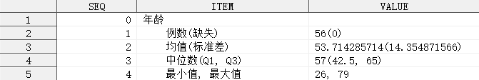

## 简介

单组单个定量指标的分析，输出均值、中位数、标准差、最大值、最小值、Q1、Q3 等指标。

## 语法

### 必选参数

- [INDATA](#indata)
- [VAR](#var)

### 可选参数

- [PATTERN](#pattern)
- [OUTDATA](#outdata)
- [STAT_FORMAT](#stat_format)
- [STAT_NOTE](#stat_note)
- [LABEL](#label)
- [INDENT](#indent)

### 调试参数

- [DEL_TEMP_DATA](#del_temp_data)

## 参数说明

### INDATA

**Syntax** : <_libname._>_dataset_(_dataset-options_)

指定用于定量分析的数据集，可包含数据集选项

_libname_: 数据集所在的逻辑库名称

_dataset_: 数据集名称

_dataset-options_: 数据集选项，兼容 SAS 系统支持的所有数据集选项

**Usage** :

```sas
INDATA = ADSL
INDATA = SHKY.ADSL
INDATA = SHKY.ADSL(where = (FAS = "Y"))
```

[**Example**](#一般用法)

---

### VAR

**Syntax** : _variable_

指定定量分析的变量。

**Caution** :

1. 参数 `VAR` 不允许指定不存在于参数 `INDATA` 指定的数据集中的变量；
2. 参数 `VAR` 不允许指定字符型变量；

**Usage** :

```sas
VAR = AGE
```

[**Example**](#一般用法)

---

### PATTERN

**Syntax** : _row-1-specification_<|_row-2-specification_<|...>>

指定需计算的统计量及统计量的输出模式，输出模式定义了统计量是如何进行组合的，以及统计量在输出数据集中的位置。

_`row-i-specification`_ 表示输出数据集中第 _`i`_`+ 1` 行（第 1 行固定为分析变量的标签）的统计量结果展示模式，输出数据集中的每一行均用一个 _`row-i-specification`_ 进行定义，不同行的定义之间使用字符 `|` 隔开，其中 _`row-i-specification`_ 的语法如下：

- _string(s)_
- #_statistic-keyword_
- <_string(s)_>#_statistic-keyword_<_string(s)_>
- <_string(s)_>#_statistic-keyword-1_<_string(s)_><#_statistic-keyword-2_><_string(s)_><...>

_`statistic-keyword`_ 可以指定以下统计量：

| 统计量   | 简写 | 含义               |
| -------- | ---- | ------------------ |
| N        |      | 例数               |
| NMISS    |      | 缺失               |
| MEAN     |      | 均值               |
| VAR      |      | 方差               |
| STDDEV   | STD  | 标准差             |
| STDERR   |      | 标准误             |
| RANGE    |      | 极差               |
| MEDIAN   |      | 中位数             |
| MODE     |      | 众数               |
| Q1       |      | 下四分位数         |
| Q3       |      | 上四分位数         |
| QRANGE   |      | 四分位间距         |
| MIN      |      | 最小值             |
| MAX      |      | 最大值             |
| CV       |      | 变异系数           |
| KURTOSIS | KURT | 峰度               |
| SKEWNESS | SKEW | 偏度               |
| LCLM     |      | 均值的 95%置信下限 |
| UCLM     |      | 均值的 95%置信上限 |
| SUM      |      | 总和               |
| USS      |      | 未校正平方和       |
| CSS      |      | 校正平方和         |
| P1       |      | 第 1 百分位数      |
| P5       |      | 第 5 百分位数      |
| P10      |      | 第 10 百分位数     |
| P20      |      | 第 20 百分位数     |
| P25      |      | 第 25 百分位数     |
| P30      |      | 第 30 百分位数     |
| P40      |      | 第 40 百分位数     |
| P50      |      | 第 50 百分位数     |
| P60      |      | 第 60 百分位数     |
| P70      |      | 第 70 百分位数     |
| P75      |      | 第 75 百分位数     |
| P80      |      | 第 80 百分位数     |
| P90      |      | 第 90 百分位数     |
| P95      |      | 第 95 百分位数     |
| P99      |      | 第 99 百分位数     |

_`string(s)`_ 可以是任意字符（串），若字符串含有字符 `|`，则使用 `#|` 进行转义，若字符串含有字符 `#`，则使用 `##` 进行转义。

**Default** : `%nrstr(#N(#NMISS)|#MEAN(#STD)|#MEDIAN(#Q1, #Q3)|#MIN, #MAX)`

**Caution** :

1. 若紧跟在 _statistic-keyword_ 之后的 _string(s)_ 的部分字符与 _statistic-keyword_ 可以组合成另一个 _statistic-keyword_，为了避免混淆，应当在 _statistic-keyword_ 后添加一个 `.`，然后再添加 _string(s)_。例如：`PATTERN = #N(#N.MISS)|#MEAN(#STD)`，其中 `#N.MISS` 代表将计算例数与字符串 `MISS` 进行连接；
2. 若 _statistic-keyword_ 之后的第一个字符是 `.`，则需要使用 `..` 才能正确表示。例如：`PATTERN = #N(#N..MISS)|#MEAN(#STD)`；
3. 若 #_statistic-keyword_ 之前的第一个字符是 `#`，则需要使用 `#.` 才能正确表示。例如：`PATTERN = ##.#MEAN`；
4. 若 #_statistic-keyword_ 之前的第一个字符是 `.`，则需要使用 `..` 才能正确表示。例如：`PATTERN = ..#MEAN`；
5. 若未指定任何 _statistic-keyword_，则会直接输出原始字符串，而不进行任何统计量的计算。

**Usage** :

```sas
PATTERN = #N(#NMISS)|#MEAN±#STD|#MEDIAN(#Q1, #Q3)|#MIN, #MAX
PATTERN = #N(#NMISS)|#MEAN(##.#STD)|#MEDIAN(#Q1, #Q3)|#MIN#|#|#max|#KURTOSIS, #SKEWNESS|(#LCLM, #UCLM)
```

[**Example**](#指定统计量的输出模式)

---

### OUTDATA

**Syntax** : <_libname._>_dataset_(_dataset-options_)

指定统计结果输出的数据集，可包含数据集选项，用法同参数 [INDATA](#indata)。

输出数据集有 3 个变量，具体如下：

| 变量名 | 含义                                          |
| ------ | --------------------------------------------- |
| SEQ    | 行号                                          |
| ITEM   | 指标名称                                      |
| VALUE  | 统计量在 [PATTERN](#pattern) 指定的模式下的值 |

其中，变量 `ITEM` 和 `VALUE` 默认输出到 `OUTDATA` 指定的数据集中，其余变量默认隐藏。

**Default** : RES\_&_VAR_

默认情况下，输出数据集的名称为 `RES_`_`var`_，其中 `var` 为参数 [VAR](#var) 指定的变量名。

**Tips** :

如需显示隐藏的变量，可使用数据集选项实现，例如：`OUTDATA = T1(KEEP = SEQ ITEM VALUE)`

**Usage** :

```sas
OUTDATA = T1
OUTDATA = T1(KEEP = SEQ ITEM VALUE)
```

[**Example**](#指定需要保留的变量)

---

### STAT_FORMAT

**Syntax** : <(> #_statistic-keyword-1_ = _format-1_ <, #_statistic-keyword-2_ = _format-2_ <, ...>> <)>

指定输出结果中统计量的输出格式。

**Default** : #AUTO

默认情况下，宏程序将根据参数 [VAR](#var) 指定的变量在数据集中的具体值，决定各统计量的输出格式，具体如下：

| 统计量          | 简写 | 输出格式 _w_                  | 输出格式 _d_      |
| --------------- | ---- | ----------------------------- | ----------------- |
| N               |      | 由 SAS 决定                   | 由 SAS 决定       |
| NMISS           |      | 由 SAS 决定                   | 由 SAS 决定       |
| MEAN            |      | _int_ + min(_dec_ + 1, 4) + 2 | min(_dec_ + 1, 4) |
| VAR             |      | _int_ + min(_dec_ + 2, 4) + 2 | min(_dec_ + 2, 4) |
| STDDEV          | STD  | _int_ + min(_dec_ + 2, 4) + 2 | min(_dec_ + 2, 4) |
| STDERR          |      | _int_ + min(_dec_ + 2, 4) + 2 | min(_dec_ + 2, 4) |
| RANGE           |      | _int_ + min(_dec_, 4) + 2     | min(_dec_, 4)     |
| MEDIAN          |      | _int_ + min(_dec_ + 1, 4) + 2 | min(_dec_ + 1, 4) |
| MODE            |      | _int_ + min(_dec_, 4) + 2     | min(_dec_, 4)     |
| Q1              |      | _int_ + min(_dec_ + 1, 4) + 2 | min(_dec_ + 1, 4) |
| Q3              |      | _int_ + min(_dec_ + 1, 4) + 2 | min(_dec_ + 1, 4) |
| QRANGE          |      | _int_ + min(_dec_ + 1, 4) + 2 | min(_dec_ + 1, 4) |
| MIN             |      | _int_ + min(_dec_, 4) + 2     | min(_dec_, 4)     |
| MAX             |      | _int_ + min(_dec_, 4) + 2     | min(_dec_, 4)     |
| CV              |      | _int_ + min(_dec_ + 2, 4) + 2 | min(_dec_ + 2, 4) |
| KURTOSIS        | KURT | _int_ + min(_dec_ + 3, 4) + 2 | min(_dec_ + 3, 4) |
| SKEWNESS        | SKEW | _int_ + min(_dec_ + 3, 4) + 2 | min(_dec_ + 3, 4) |
| LCLM            |      | _int_ + min(_dec_ + 1, 4) + 2 | min(_dec_ + 1, 4) |
| UCLM            |      | _int_ + min(_dec_ + 1, 4) + 2 | min(_dec_ + 1, 4) |
| SUM             |      | _int_ + min(_dec_, 4) + 2     | min(_dec_, 4)     |
| USS             |      | _int_ + min(_dec_ + 2, 4) + 2 | min(_dec_ + 2, 4) |
| CSS             |      | _int_ + min(_dec_ + 2, 4) + 2 | min(_dec_ + 2, 4) |
| P1              |      | _int_ + min(_dec_ + 1, 4) + 2 | min(_dec_ + 1, 4) |
| P5              |      | _int_ + min(_dec_ + 1, 4) + 2 | min(_dec_ + 1, 4) |
| P10             |      | _int_ + min(_dec_ + 1, 4) + 2 | min(_dec_ + 1, 4) |
| P20             |      | _int_ + min(_dec_ + 1, 4) + 2 | min(_dec_ + 1, 4) |
| P30             |      | _int_ + min(_dec_ + 1, 4) + 2 | min(_dec_ + 1, 4) |
| P40             |      | _int_ + min(_dec_ + 1, 4) + 2 | min(_dec_ + 1, 4) |
| P50             |      | _int_ + min(_dec_ + 1, 4) + 2 | min(_dec_ + 1, 4) |
| P60             |      | _int_ + min(_dec_ + 1, 4) + 2 | min(_dec_ + 1, 4) |
| P70             |      | _int_ + min(_dec_ + 1, 4) + 2 | min(_dec_ + 1, 4) |
| P75             |      | _int_ + min(_dec_ + 1, 4) + 2 | min(_dec_ + 1, 4) |
| P80             |      | _int_ + min(_dec_ + 1, 4) + 2 | min(_dec_ + 1, 4) |
| P90             |      | _int_ + min(_dec_ + 1, 4) + 2 | min(_dec_ + 1, 4) |
| P95             |      | _int_ + min(_dec_ + 1, 4) + 2 | min(_dec_ + 1, 4) |
| P99             |      | _int_ + min(_dec_ + 1, 4) + 2 | min(_dec_ + 1, 4) |
| TS <sup>1</sup> |      | _#AUTO_ <sup>2</sup>          | 4                 |
| P <sup>1</sup>  |      | _#AUTO_ <sup>3</sup>          | -                 |

其中，_int_ 表示变量 [VAR](_var_) 在数据集中使用默认输出格式打印后的整数部分的最大长度，_dec_ 表示变量 [VAR](_var_) 在数据集中使用默认输出格式打印后的小数部分的最大长度，_w.d_ 表示统计量的输出格式。

举例说明：

1. 均值的输出格式 _w.d_ 中，_w_ 部分为实际整数位数 + 比实际小数位数多 1 位（若超过 4 位则只保留 4 位）+ 2（用于表示小数点和负号），_d_ 部分为比实际小数位数多 1 位（若超过 4 位则只保留 4 位）；
2. 标准差的输出格式 _w.d_ 中，_w_ 部分为实际整数位数 + 比实际小数位数多 2 位（若超过 4 位则只保留 4 位）+ 2（用于表示小数点和负号），_d_ 部分为比实际小数位数多 2 位（若超过 4 位则只保留 4 位）；
3. 最大值的输出格式 _w.d_ 中，_w_ 部分为实际整数位数 + 实际小数位数（若超过 4 位则只保留 4 位） + 2（用于表示小数点和负号），_d_ 部分为实际小数位数（若超过 4 位则只保留 4 位）；

<sup>1</sup> 仅在宏 `%quantify_multi_test` 中可用；

<sup>2</sup> 检验统计量输出格式的默认值为 _w.d_，其中：

- _w_ = $\max(\lceil\log_{10}\left|s\right|\rceil, 7)$， $s$ 表示检验统计量的值
- _d_ = 4

<sup>3</sup> 假设检验 P 值输出格式的默认值为 `qtmt_pvalue.`，`qtmt_pvalue.` 由以下 PROC FORMAT 过程定义：

```sas
proc format;
    picture qtmt_pvalue(round  max = 7)
            low - < 0.0001 = "<0.0001"(noedit)
            other = "9.9999";
run;
```

当上述统计量输出格式无法满足实际需求时，可通过参数 `STAT_FORMAT` 重新指定某个统计量的输出格式。

**Usage** :

```sas
STAT_FORMAT = (#MEAN = 4.1, #STD = 5.2, #MEDIAN = 4.1, #Q1 = 4.1, #Q3 = 4.1)
STAT_FORMAT = (#MEAN = 4.1, #STD = 5.2, #MEDIAN = 4.1, #Q1 = 4.1, #Q3 = 4.1, #TS = 8.4, #P = pv.)
```

**Special Usage** :

```sas
STAT_FORMAT = #PREV
```

重复调用 `%quantify()` 时，如果第一次调用后即可确定后续调用时需要的统计量输出格式，可在第二次及之后调用 `%quantify()` 时，指定 `STAT_FORMAT = #PREV`。

**Caution** :

1. 首次调用 `quantify()` 时，不可指定 `STAT_FORMAT = #PREV`。

[**Example**](#指定统计量的输出格式)

---

### STAT_NOTE

**Syntax** : <(> #_statisic-keyword-1_ = _string-1_ <, #_statistic-keyword-2_ = _string-2_ <, ...>> <)>

指定输出结果中统计量的说明文字，该说明文字将会出现在输出数据集的 `ITEM` 列中。

**Default** : #AUTO

默认情况下，绝大部分统计量的说明文字与参数 [PATTERN](#pattern) 中对 _statistic-keyword_ 描述的含义一致，Q1 和 Q3 是例外，具体各统计量的说明文字如下：

| 统计量   | 简写 | 说明文字           |
| -------- | ---- | ------------------ |
| N        |      | 例数               |
| NMISS    |      | 缺失               |
| MEAN     |      | 均值               |
| VAR      |      | 方差               |
| STDDEV   | STD  | 标准差             |
| STDERR   |      | 标准误             |
| RANGE    |      | 极差               |
| MEDIAN   |      | 中位数             |
| MODE     |      | 众数               |
| Q1       |      | Q1                 |
| Q3       |      | Q3                 |
| QRANGE   |      | 四分位间距         |
| MIN      |      | 最小值             |
| MAX      |      | 最大值             |
| CV       |      | 变异系数           |
| KURTOSIS | KURT | 峰度               |
| SKEWNESS | SKEW | 偏度               |
| LCLM     |      | 均值的 95%置信下限 |
| UCLM     |      | 均值的 95%置信上限 |
| SUM      |      | 总和               |
| USS      |      | 未校正平方和       |
| CSS      |      | 校正平方和         |
| P1       |      | 第 1 百分位数      |
| P5       |      | 第 5 百分位数      |
| P10      |      | 第 10 百分位数     |
| P20      |      | 第 20 百分位数     |
| P30      |      | 第 30 百分位数     |
| P40      |      | 第 40 百分位数     |
| P50      |      | 第 50 百分位数     |
| P60      |      | 第 60 百分位数     |
| P70      |      | 第 70 百分位数     |
| P75      |      | 第 75 百分位数     |
| P80      |      | 第 80 百分位数     |
| P90      |      | 第 90 百分位数     |
| P95      |      | 第 95 百分位数     |
| P99      |      | 第 99 百分位数     |

---

**Usage** :

```sas
STAT_NOTE = (#N = "靶区数", #MEAN = "平均值")
```

[**Example**](#指定统计量的说明文字)

### LABEL

**Syntax** : _string_

指定输出结果中第一行显示的标签字符串，该字符串必须使用匹配的单（双）引号包围。

如果指定的 `LABEL` 中含有不匹配的引号，例如，需要指定 `LABEL` 为一个单引号，可以选择以下传参方式：

```sas
LABEL = "'"
```

但不能使用以下传参方式：

```sas
LABEL = ''''
```

**Default** : #AUTO

默认情况下，宏程序将自动获取变量 `VAR` 的标签，若标签为空，则使用变量 `VAR` 的变量名作为标签。

**Usage** :

```sas
LABEL = "年龄（岁）"
```

[**Example**](#指定分析变量的标签)

---

### INDENT

**Syntax** : _string_

指定输出结果各分类的缩进字符串，该字符串必须使用匹配的单（双）引号包围。

如果指定的 `INDENT` 中含有不匹配的引号，例如，需要指定 `INDENT` 为一个单引号，可以选择以下传参方式：

```sas
INDENT = "'"
```

但不能使用以下传参方式：

```sas
INDENT = ''''
```

**Default** : #AUTO

默认情况下，各分类前使用 4 个英文空格作为缩进字符。

**Tips** :

1. 可以使用 RTF 控制符控制缩进，例如：五号字体下缩进 2 个中文字符，可指定参数 `INDENT = "\li420 "`

**Usage** :

```sas
INDENT = "\li420 "
```

[**Example**](#指定缩进字符串)

---

### DEL_TEMP_DATA

**Syntax** : TRUE|FALSE

指定是否删除宏程序运行过程生成的中间数据集。

**Default** : TRUE

默认情况下，宏程序会自动删除运行过程生成的中间数据集。

⚠ 此参数用于开发者调试，一般无需关注。

---

## 例子

### 打开帮助文档

```sas
%quantify();
%quantify(help);
```

### 一般用法

```sas
%quantify(indata = adsl, var = age);
```


### 指定统计量的输出模式

```sas
%quantify(indata = adsl, var = age,
          pattern = %nrstr(#N(#NMISS)#Q1|#MEAN(##.#STD)|#MEDIAN(#Q1, #Q3)|#MIN#|#|#max));
```


上述例子中，使用参数 `PATTERN` 改变了默认的统计量输出模式，第二行额外输出了统计量 `Q1`，第三行使用 `##` 对 `#` 进行转义，最后一行最小值和最大值使用 `||` 进行分隔，同样使用 `#|` 对 `|` 进行转义。

### 指定需要保留的变量

```sas
%quantify(indata = adsl, var = age, outdata = t1(keep = seq item value));
```



### 指定统计量的输出格式

```sas
%quantify(indata = adsl, var = age,
          stat_format = (#MEAN = 4.1, #STD = 5.2, #MEDIAN = 4.1, #Q1 = 4.1, #Q3 = 4.1));
```


### 指定统计量的说明文字

```sas
%quantify(indata = adsl, var = age,
          stat_note = (#N = "靶区数", #MEAN = "平均值", #Q1 = "下四分位数", #Q3 = "上四分位数"));
```


### 指定分析变量的标签

```sas
%quantify(indata = adsl, var = age,
          stat_format = (#MEAN = 4.1, #STD = 5.2, #MEDIAN = 4.1, #Q1 = 4.1, #Q3 = 4.1), label = "年龄(岁)");
```


### 指定缩进字符串

```sas
%quantify(indata = adsl, var = age,
          stat_format = (#MEAN = 4.1, #STD = 5.2, #MEDIAN = 4.1, #Q1 = 4.1, #Q3 = 4.1), indent = "\li420 ");
```

上述例子中，使用参数 `INDENT` 指定了缩进字符串，如需使 RTF 控制符生效，需要在传送至 ODS 的同时，指定相关元素的 `PROTECTSPECIALCHAR` 属性值为 `OFF`。
