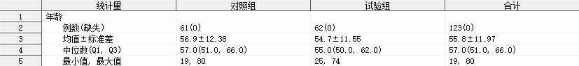
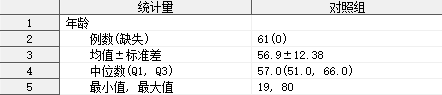
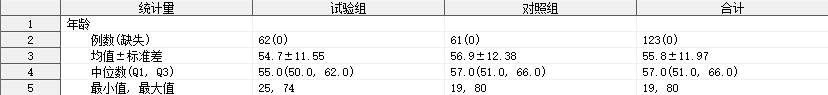

## 简介

多组单个定量指标的分析，输出均值、中位数、标准差、最大值、最小值、Q1、Q3 等指标。

## 语法

### 必选参数

- [indata](#indata)
- [var](#var)
- [group](#group)

### 可选参数

- [groupby](#groupby)
- [pattern](#pattern)
- [outdata](#outdata)
- [stat_format](#stat_format)
- [stat_note](#stat_note)
- [label](#label)
- [indent](#indent)

### 调试参数

- [debug](#debug)

## 参数说明

### indata

用法同 [indata](../quantify/readme.md#indata)。

---

### var

用法同 [var](../quantify/readme.md#var)。

---

### group

**Syntax** :

- _variable_
- _variable_("_category-1_"<, "_category-2_", ...>)

指定分组变量，_`category`_ 表示需要统计的分组水平名称。

> [!WARNING]
>
> - 参数 `group` 不允许指定不存在于参数 [indata](#indata) 指定的数据集中的变量；
> - 参数 `group` 不允许指定数值型变量；

**Usage** :

```sas
group = arm
group = arm("试验组", "对照组")
```

[**Example**](#指定分组变量的水平名称)

---

### groupby

**Syntax** : _variable_<(asc\<ending\> | desc\<ending\>)>

指定分组变量的排序

**Default** : `#auto`

默认情况下，各个分组的输出结果根据分组水平名称在当前语言环境下的默认排列顺序排序（例如：gbk 环境下，按照水平名称的汉语拼音顺序）

> [!WARNING]
>
> - 参数 `groupby` 不允许指定不存在于参数 [indata](#indata) 指定的数据集中的变量；

> [!NOTE]
>
> - 参数 `group` 若指定了分组变量的各水平名称，则各水平分组的统计结果将按照参数 `group` 中各水平名称指定的顺序显示在输出数据集中，此时参数 `groupby` 无效。

**Usage** :

```sas
groupby = armn
```

[**Example**](#指定分组变量的排序变量)

---

### outdata

**Syntax** : <_libname._>_dataset_(_dataset-options_)

指定统计结果输出的数据集，可包含数据集选项，用法同参数 [indata](#indata)。

输出数据集有 $m + 3$ 个变量，其中 $m$ 为参数 [group](#group) 指定的分组变量的水平数，具体如下：

| 变量名        | 含义                                                                         |
| ------------- | ---------------------------------------------------------------------------- |
| `seq`         | 行号                                                                         |
| `item`        | 指标名称                                                                     |
| `value_`_`i`_ | `group` 的第 _i_ 个水平的统计量在 [pattern](#pattern) 指定的模式下的格式化值 |
| `value_sum`   | `group` 的所有水平合计的统计量在 [pattern](#pattern) 指定的模式下的格式化值  |

其中，变量 `item`、`value_`_`i`_、`value_sum` 默认输出到 [outdata](#outdata) 指定的数据集中，其余变量默认隐藏。

> [!NOTE]
>
> - 当 `group` 的水平数量为 1 时，变量 `value_sum` 默认隐藏。

**Default** : `res_`_`var`_

默认情况下，输出数据集的名称为 `res_`_`var`_，其中 `var` 为参数 [var](#var) 指定的变量名。

> [!TIP]
>
> - 如需显示隐藏的变量，可使用数据集选项实现，例如：`outdata = t1(keep = seq item value_1 value_2 value_sum)`

**Usage** :

```sas
outdata = t1
outdata = t1(keep = seq item value_1 value_2 value_sum)
```

---

### pattern

用法同 [pattern](../quantify/readme.md#pattern)。

---

### stat_format

用法同 [stat_format](../quantify/readme.md#stat_format)。

---

### stat_note

用法同 [stat_note](../quantify/readme.md#stat_note)。

---

### label

用法同 [label](../quantify/readme.md#label)。

---

### indent

用法同 [indent](../quantify/readme.md#indent)。

---

### debug

**Syntax** : `true` | `false`

指定是否删除宏程序运行过程生成的中间数据集。

**Default** : `false`

默认情况下，宏程序会自动删除运行过程生成的中间数据集。

> [!NOTE]
>
> - 此参数用于开发者调试，一般无需关注。
> - 本宏程序内部调用的依赖宏程序 `%quantify` 运行过程中生成的中间数据集无法通过此参数控制，在退出 `%quantify` 时，这些中间数据集默认被删除，如需单独调试宏程序 `%quantify`，请单独调用 `%quantify` 并指定 `debug = true`。

---

## 例子

### 打开帮助文档

```sas
%quantify_multi();
%quantify_multi(help);
```

### 一般用法

```sas
%quantify_multi(indata = adam.adsl(where = (FASFL = "Y")), var = age, group = arm);
```



### 指定分组变量的水平名称

```sas
%quantify_multi(indata = adam.adsl(where = (FASFL = "Y")), var = age, group = arm("对照组"));
```



### 指定分组变量的排序变量

```sas
%quantify_multi(indata = adam.adsl(where = (FASFL = "Y")), var = age, group = arm, groupby = armn);
```


