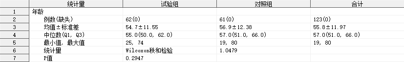

## 简介

多组单个定量指标的分析，输出均值、中位数、标准差、最大值、最小值、Q1、Q3 等指标，并进行差异性检验。

## 语法

### 必选参数

- [INDATA](#indata)
- [VAR](#var)
- [GROUP](#group)

### 可选参数

- [GROUPBY](#groupby)
- [PATTERN](#pattern)
- [OUTDATA](#outdata)
- [STAT_FORMAT](#stat_format)
- [STAT_NOTE](#stat_note)
- [LABEL](#label)
- [INDENT](#indent)
- [PROCHTTP_PROXY](#prochttp_proxy)

### 调试参数

- [DEL_TEMP_DATA](#del_temp_data)

## 参数说明

### INDATA

用法同 [INDATA](../quantify/readme.md#indata)。

---

### VAR

用法同 [VAR](../quantify/readme.md#var)。

---

### GROUP

用法同 [GROUP](../quantify_multi/readme.md#group)

---

### GROUPBY

用法同 [GROUPBY](../quantify_multi/readme.md#groupby)

---

### OUTDATA

用法同 [OUTDATA](../quantify_multi/readme.md#outdata)

---

### PATTERN

用法同 [PATTERN](../quantify/readme.md#pattern)。

---

### STAT_FORMAT

用法同 [STAT_FORMAT](../quantify/readme.md#stat_format)。

---

### STAT_NOTE

用法同 [STAT_NOTE](../quantify/readme.md#stat_note)。

---

### LABEL

用法同 [LABEL](../quantify/readme.md#label)。

---

### INDENT

用法同 [INDENT](../quantify/readme.md#indent)。

---

### PROCHTTP_PROXY

**Syntax** : _host_:_port_

指定代理主机和端口。

本宏程序将自动检查前置依赖程序是否已经导入，若发现前置依赖程序未导入，则尝试从网络上下载最新版本程序文件，使用此参数可指定网络连接使用的代理主机和端口。

**Default** : 127.0.0.1:7890

---

### DEL_TEMP_DATA

**Syntax** : TRUE|FALSE

指定是否删除宏程序运行过程生成的中间数据集。

**Default** : TRUE

默认情况下，宏程序会自动删除运行过程生成的中间数据集。

> [!NOTE]
>
> - 此参数用于开发者调试，一般无需关注。
> - 本宏程序内部调用的依赖宏程序 `%quantify_multi` 运行过程中生成的中间数据集无法通过此参数控制，在退出 `%quantify_multi` 时，这些中间数据集默认被删除，如需单独调试宏程序 `%quantify_multi`，请单独调用 `%quantify_multi` 并指定 `DEL_TEMP_DATA = FALSE`。

---

## 例子

### 打开帮助文档

```sas
%quantify_multi_test();
%quantify_multi_test(help);
```

### 一般用法

```sas
%quantify_multi_test(indata = adam.adsl(where = (fasfl = "Y")), var = age, group = arm, groupby = armn);
```


