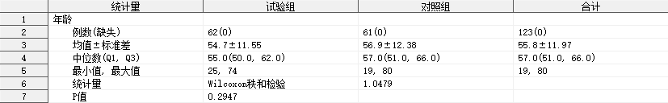

## 简介

多组单个定量指标的分析，输出均值、中位数、标准差、最大值、最小值、Q1、Q3 等指标，并进行差异性检验。

## 语法

### 必选参数

- [indata](#indata)
- [var](#var)
- [group](#group)

### 可选参数

- [groupby](#groupby)
- [pattern](#pattern)
- [outdata](#outdata)
- [stat_format](#stat_format)
- [stat_note](#stat_note)
- [label](#label)
- [indent](#indent)

### 调试参数

- [debug](#debug)

## 参数说明

### indata

用法同 [indata](../quantify/readme.md#indata)。

---

### var

用法同 [var](../quantify/readme.md#var)。

---

### group

用法同 [group](../quantify_multi/readme.md#group)

---

### groupby

用法同 [groupby](../quantify_multi/readme.md#groupby)

---

### outdata

用法同 [outdata](../quantify_multi/readme.md#outdata)

---

### pattern

用法同 [pattern](../quantify/readme.md#pattern)。

---

### stat_format

用法同 [stat_format](../quantify/readme.md#stat_format)。

---

### stat_note

用法同 [stat_note](../quantify/readme.md#stat_note)。

---

### label

用法同 [label](../quantify/readme.md#label)。

---

### indent

用法同 [indent](../quantify/readme.md#indent)。

---

### debug

**Syntax** : `true` | `false`

指定是否删除宏程序运行过程生成的中间数据集。

**Default** : `false`

默认情况下，宏程序会自动删除运行过程生成的中间数据集。

> [!NOTE]
>
> - 此参数用于开发者调试，一般无需关注。
> - 本宏程序内部调用的依赖宏程序 `%quantify_multi` 运行过程中生成的中间数据集无法通过此参数控制，在退出 `%quantify_multi` 时，这些中间数据集默认被删除，如需单独调试宏程序 `%quantify_multi`，请单独调用 `%quantify_multi` 并指定 `debug = true`。

---

## 例子

### 打开帮助文档

```sas
%quantify_multi_test();
%quantify_multi_test(help);
```

### 一般用法

```sas
%quantify_multi_test(indata = adam.adsl(where = (fasfl = "Y")), var = age, group = arm, groupby = armn);
```


